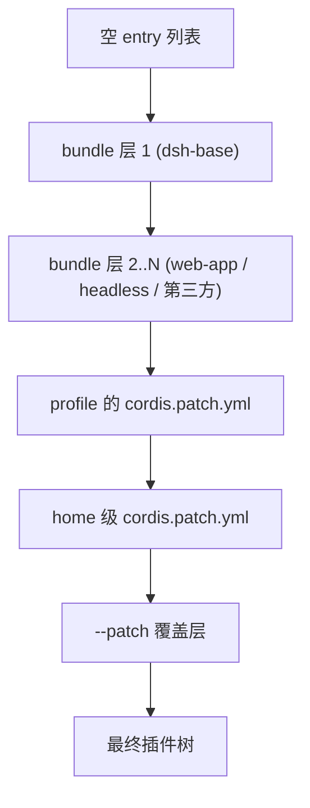

# DeepSeek Harness 系统架构

<!-- @section: overview -->
## 概述

dsh 是一个**事件溯源 + 微内核**的 agent 运行时：

- **微内核** = Cordis 上下文树。没有 framework 核心，只有服务（`ctx.<key>`）、类型化事件、可逆效果。
- **事件溯源** = session log。append-only 的 `SessionEvent` 序列是唯一真相源，模型看到的消息历史是从日志 **派生** 出来的（`deriveMessages()`），不单独存储。

这两点决定了其余一切：replay、fork、恢复、遥测、UI 渲染、压缩，全部是同一条事件流的不同投影。

<!-- @end-section -->

<!-- @section: cordis -->
## Cordis：底座的五个概念

| 概念 | 内容 |
|---|---|
| 插件即实现 Service 的对象 | 可以是带 `inject` / `apply(ctx)` 的函数，也可以是 `Service` 子类 |
| 上下文即服务仓库 | 服务占据稳定的 `ctx.<key>`（`ctx.tools` / `ctx.llm` / `ctx.sessions`），消费方按 key 找服务而非 import 具体实现 |
| `inject` 声明依赖 | 声明所需服务的插件会等待服务出现——加载顺序由服务需求表达，不靠手工 boot 序列 |
| 类型化事件通信 | 服务通过 TS 声明合并声明事件名，再按 `emit` / `waterfall` / `parallel` / `serial` 派发 |
| 注册即可逆效果 | 一切贡献经 `ctx.effect()` / `ctx.on()` 安装，reload 与 teardown 可预测回卷 |

派发模式是事件公开契约的一部分（用 `@mode` JSDoc 标注，生成的目录会校验声明与派发点是否一致）：

| 模式 | await | 顺序 | 有返回值 |
|---|---|---|---|
| `emit` | 否 | 注册序 | 否 |
| `waterfall` | 否 | 注册序 | 是 |
| `parallel` | 是 | 并行 | 否 |
| `serial` | 是 | 注册序 | 是 |

**waterfall 是 around-middleware**：监听器签名 `(...args, next)`，调用 `next()` 把（可能已包装的）结果交给下一个服务，不调用 `next()` 就短路。协作型监听器通常变更共享的 request/decision 对象再委派；策略型监听器在自己拥有该决策时直接短路返回。**不调 `next()` 会截断链**，是 dsh 里最容易写错的地方，AGENTS.md 单列了一条硬约束。

<!-- @end-section -->

<!-- @section: composition -->
## 组合：Profile 与 Bundle

一个运行中的 dsh，是启动时由**有序补丁层**组合出来的插件树。

- **Profile**：存放在 Harness home（`$DSH_HOME`，缺省 `~/.dsh`）下 `profiles/<name>/` 的具名组合。它的 `package.json` 里 `dsh.profile.bundles` 列出所堆叠的 bundle，目录内还有用户自己的 `cordis.patch.yml`，以及 out-of-tree 插件依赖。`web` 与 `headless` 作为模板首次使用时自动初始化。
- **Bundle**：npm 包，manifest 声明 `"dsh": { "bundle": { "patch": "./cordis.patch.yml" } }`，本体就是一份 Cordis 配置行补丁列表（可能附带它挂载的运行时胶水插件）。

层序（作用于空 entry 列表）：



补丁按 **id 定位行，整体替换该行的 config**（不做深合并，所以覆盖时要把保留字段重述一遍），或者用 `insert` 插入新行。查看本机实际启动的树：

```bash
dsh --profile web --dump-config
```

`dsh-base` 是每个 profile 的第一层：模型适配器、工具集、持久化、沙箱与审批策略、settings、credentials、遥测、host 级 subagent provider。它还在同一份补丁里按平台开关两套 shell 栈——`bash-sandbox`/`tool-bash` 在 win32 上 `disabled`，`pwsh-sandbox`/`tool-pwsh` 反之，因为两族执行器注册同一个 `ctx.shell` 服务，同时挂载会因重复服务注册而**响亮失败**。

启动由 `dsh-app-boot` 统一：解析配置路径 → 分层加载 `.env`（继承环境 > 项目 `.env` > 用户 `.env`）→ 装 fail-loud 钩子 → 挂载 include 根 → 等待树 settle → `assertEntriesLoaded` / `assertEntriesActivated` 审计（未解析的插件、未满足的服务依赖都要点名报错）。profile 的 `cordis.patch.yml` 由 `watchUserPatches` 保持热更新，解析失败保留上一份可用树并广播 `hmr/config-update-failed`。

<!-- @end-section -->

<!-- @section: core-services -->
## 核心服务图

| 包 | 拥有 | ctx key |
|---|---|---|
| `core/session` | append-only `SessionEvent` 日志与内存会话仓 | `ctx.sessions` |
| `core/system-prompt` | prompt 分段与工具 schema 装配 | `ctx.systemPrompt` |
| `core/tools` | 作用域化工具注册表 + 受守护的执行管线 | `ctx.tools` |
| `core/agent` | `Agent` 接口、活体注册表、`agent/*` 事件词汇 | `ctx.agents` |
| `core/agent-loop` | 实现该接口的默认驱动 | `ctx.agentLoop` |
| `core/scope` | per-agent 作用域注册原语（纯库，无 ctx key） | — |
| `llm/llm` | 消息/流式词汇 + 适配器 seam | `ctx.llm` |

关键设计：`agent-loop` 是**唯一具体循环实现**，但扩展插件一律依赖 `dsh-agent`（接口与事件），从不依赖 `agent-loop`，因此循环本身可替换。`scope` 是唯一非服务包——零依赖库，位于 `session` 与 `system-prompt` 之下，避免循环依赖。

<!-- @end-section -->

<!-- @section: events -->
## 事件三域

选对事件域是大多数改动的第一个决策：

| 域 | 语义 | 何时用 |
|---|---|---|
| **Session 事件** | 追加到日志的持久事实，经 `session/event` 广播 | 事实必须跨重载存活时 |
| **Agent 事件**（`agent/*`） | 携带活体 `Agent`：inbox、step、status、request、校验、续跑 | 观察或拦截进行中的工作 |
| **Capability 事件**（`fs/*`、`tools/*`、`telemetry/*`） | 把策略与适配器挂到 seam 上 | 不 import 主循环即可加策略 |

`docs/event-producer-consumer.md` 列出每个事件的生产者与消费者（生成物）。

<!-- @end-section -->

<!-- @section: turn-flow -->
## Turn / Step 生命周期

术语：**step** = 一次模型请求 + 它调用的工具；**turn** = 零个或多个 step，在首个输入被 claim 前打开，在无债可还时关闭。

```text
turn/start
  claim next-step 输入 + 一条排队消息
  装配 prompt 分段 + 工具 schema
  -> agent/pre-step                   reject | enter(messages)
     reject，或首个 enter 被改写为空 -> 关闭 turn，不产生 step
     step/start
     entered 消息作为 user/message 追加
     从日志派生模型历史
     agent/request -> llm/stream -> assistant/chunk* -> assistant/message
     tool/call* -> tools/pre-execute -> tools/execute -> tools/post-execute -> tool/result*
     step/end
     工具还欠一次请求，或 next-step 输入到达 -> claim -> 下一 step
  -> agent/turn-stopping
turn/end
```

其中 `turn/*`、`step/*`、`user/message`、`assistant/*`、`tool/*` 是持久 session 事件；其余是活体扩展点。`agent/pre-step`、`agent/request`、`llm/stream` 与三个 `tools/*` 是 waterfall（监听器必须 `next()`）；`agent/turn-stopping` 是 serial，无 `next()`。

几条容易踩的语义：

- 输入统一走**一个 inbox**。部分消息立刻唤醒驱动（`followup` / `steer`），`inject()` 的注入上下文则在 inbox 里等到别的消息唤醒为止。
- `agent/pre-step` 决定模型看到什么：监听器可改写被 claim 的消息，也可整体拒绝；被拒绝或首个 claim 被清空时，仍会关闭一个**没有花掉 step 的持久 turn**，日志因此记录了这次尝试。
- `assistant/message` 记录每次成功的 provider 调用，包括无内容与 `max-tokens` 结束；空内容不进派生历史，但持久事件保留 usage 与 `sourceEventSeqs`（精确指向哪些 `assistant/chunk`）。
- `agent/request-error` 只被 `dsh-compaction-basic` 用于「规范上下文溢出」的恢复；恢复只在剪枝或摘要真正推进了「surface 替换代数」时才开新的重试 turn，否则原始请求错误仍然权威。

配套时序图见 `docs/agent-lifecycle.md`。

<!-- @end-section -->

<!-- @section: session-log -->
## Session Log：唯一真相源

`SessionEventMap` 是可合并扩展的（`declare module` 声明合并），核心成员包括 `turn/start|end`、`step/start|end`、`user/message`、`assistant/chunk`、`assistant/message`、`tool/call`、`tool/result`、`todo/write`、`request/header`、`request/context`、`session/end-seed`；compaction、hook 桥等插件各自合并进自己的 log-only 事件。

约束链条很干净：

1. **模型可见即已落日志**（runtime invariant 断言）。
2. 新增模型可见输入 ⇒ 扩展 `SessionEventMap` 并从日志渲染。
3. `SessionEventMap` 成员默认「读时必需」——构建不认识某事件类型时会**拒绝该日志**，除非事件在信封里带 `ignorable: true`；只有结构性格式变更才会提升 `SESSION_FORMAT_VERSION`（当前为 `0`，不作兼容承诺）。
4. 原始 `assistant/chunk` 保留 token 级 replay 与 UI 保真度。

持久化是另一层 seam（`ctx.sessionPersistence`，JSONL / SQLite 两个后端）：

- `session/event` 是**同步通知**，持久化插件把事件复制进 per-session 控制器，不阻塞生产者；首个待写事件启动固定批窗口，后续事件加入而不重置截止时间。
- `session/flush` 取消等待并排空到静默，主循环用它作为「claim 下一个普通 turn 前」的排序与错误观察检查点。
- 崩溃恢复**不截断**：重载发现有 `turn/start` 无 `turn/end` 时，补一条合成的 `turn/end { reason: { kind: 'interrupted' } }`。`interrupted` 是唯一不会被主循环发出的 `TurnEndReason`。
- 每会话元数据（格式版本、cwd、lineage、seed 边界）走**独立的 `SessionHeader`**，不进事件流，也不进 `deriveMessages()`。

<!-- @end-section -->

<!-- @section: extension-map -->
## 新行为该挂在哪

架构文档给了一张权威映射表（节选）：

| 目标 | 机制 |
|---|---|
| 加模型供应商 | 在 `ctx.llm` 上注册适配器 |
| 加模型可见能力 | 在 `ctx.tools` 注册；schema 自动进入 prompt 装配 |
| 给某个会话不同的能力集 | 组合 agent preset；其中的 service 行需要 `isolate` realm |
| 加 shell 执行 | 注册 `ctx.shell` 后端（本地实现经 `ctx.subprocess` 派生进程） |
| 加人类命令 | 注册到 `ctx.commands`，不经模型 turn 直接派发 |
| 加后台任务 | 注册到 `ctx.jobs`，`job_*` 工具负责收集/终止 |
| 拦截请求/工具/turn | 用对应 `agent/*` 或 `tools/*` 事件；`agent/turn-stopping` 可终止 turn |
| 加模型可见上下文 | `agent.inject()`，落在下一次被准入的请求里 |
| 加持久会话状态 | 扩展 `SessionEventMap`，从日志渲染与重放 |
| fork 活体会话 | `ctx.sessions.fork(source, boundary?, childSessionId?)` |
| 把注册限定到单个 agent | 用该 agent 的 `agent.ctx` |

「每个产品特性都映射到某个已文档化扩展点上的监听器」——这是 dsh 把微内核主张**做成可检查约束**的方式：`docs/cookbook/extension-cookbook.md` 里那张「产品特性 → 插件机制」表，任何一行都不修改主循环。

<!-- @end-section -->

## 相关文档

- [[analysis-dsh-overview-001|项目总览]] — 技术栈与仓库布局
- [[analysis-dsh-plugin-system-003|插件系统]] — capability seam 与 scope 机制
- [[analysis-dsh-capabilities-004|核心能力]] — 工具管线与各能力子系统
- [[analysis-dsh-insights-005|评估与借鉴]] — 对 Legion 的可移植点
- [[analysis-dsh-index|DeepSeek Harness 分析索引]]
