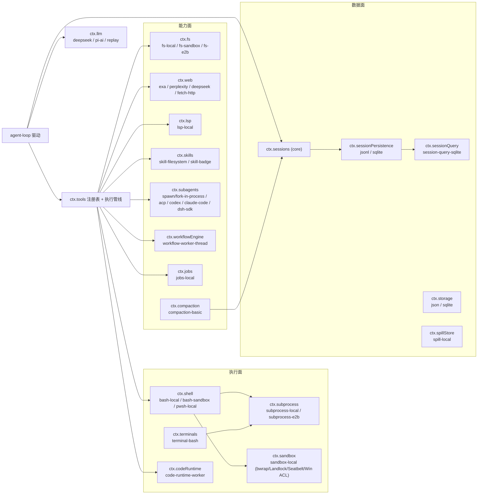

# DeepSeek Harness 插件系统

<!-- @section: overview -->
## 概述

dsh 的插件系统有四个相互独立又互相支撑的层次：

1. **Cordis 插件本体** — 服务、注入、效果、事件。
2. **Capability Seam（能力接缝）** — 三角色契约：Service Definition / Service Provider / Consumer。
3. **Scope（作用域）** — per-agent 的注册可见性与生命周期。
4. **组合层** — profile/bundle 补丁、agent preset、动态自修改、HMR。

理解顺序建议自上而下：先看接缝，再看作用域，最后看组合。

<!-- @end-section -->

<!-- @section: plugin-shape -->
## 插件的形态

最小插件就是一个模块，导出 `name`、可选 `inject`、可选 `Config` schema、以及 `apply(ctx)`：

```ts
export const name = 'tool-bash'
export const inject = ['tools', 'shell', 'systemPrompt', 'shellEnv']

/** Configuration for the bash tool. */
export interface Config {
  enableRunInBackground?: boolean
}
export const Config: z<Config> = z.object({
  enableRunInBackground: z.boolean().default(true),
})

export function apply(ctx: Context) {
  // 一切贡献都是可回卷的效果
  ctx.effect(() => ctx.tools.register(definition))
  ctx.on('tools/pre-execute', async (exec, next) => next())
}
```

要点：

- `inject` 里的名字就是 `ctx.<key>`。声明后，插件会**等待**这些服务出现才 apply，加载顺序不需要人工排。
- `Config` 是 schemastery/zod schema，同时是 TS 类型和运行时校验。「不许硬编码可调参数」这条规则的落点就在这里：随部署变化的值必须能从 `cordis.yml` 改。
- 服务型插件写成 `Service` 子类，并用 `declare module '@deepseek-ai/cordis' { interface Context { shell: ShellExecutor } }` 把自己挂到类型上。
- 同一个 ctx key **只能有一个实现**（除非该 seam 明确设计成具名注册表）。重复注册是 Cordis 标准的 duplicate-service 抛错——base bundle 靠这一点保证「每台主机恰好一套 shell 栈」。

<!-- @end-section -->

<!-- @section: seam -->
## Capability Seam：三角色契约

术语表给的定义很严格：**seam 是可替换能力的整体，永远不是其中一个角色**。

| 角色 | 含义 | shell 家族的例子 |
|---|---|---|
| Service Definition | 拥有 `ctx.<key>` 与词汇类型的 Cordis `Service`（抽象类或具体注册表，**绝不是 TS `interface`**） | `dsh-shell`（抽象 `ShellExecutor`） |
| Service Provider | 具体实现 | `dsh-bash-local` / `dsh-bash-sandbox` / `dsh-pwsh-local` |
| Consumer | 注入并使用该服务，通常是模型可见工具 | `dsh-tool-bash` / `dsh-tool-pwsh` |

角色**通常**分包，只有当它们各自独立演化时才必须分；一个包也可以同时承担多个角色（`dsh-llm` 自己既是 Definition 也是 Consumer）。新增能力意味着三个角色一起设计，不能只做一个。

这套设计的实际收益：**换一个 provider 就换掉整个产品行为**。文件系统与子进程 provider 共享同一个「执行世界」，把它们指向远程沙箱，Bash、PTY、LSP 全部跟着搬家，没有任何 provider 分叉。

现有 seam / 服务全景（`docs/capability-seams.md` 由 `scripts/gen-doc-graphs.ts` 生成，带完整性守护）：



seam 的粒度也有边界：容器、microVM、远程执行**不是 `ctx.sandbox` 的 provider**，而是整个能力接缝的兄弟实现——这条区分避免了「把一切塞进一个 provider 接口」的常见滑坡。

<!-- @end-section -->

<!-- @section: scope -->
## Scope：per-agent 的注册可见性

`dsh-scope` 是个零依赖库（`createScope` / `scopeOf` / `scopeTarget`），但它撑起了 dsh 最有价值的能力之一：**同一进程内多个 agent 各有各的工具集、prompt、人格，互不污染**。

规则（术语表定义，非常精确）：

- 贡献要么 **global**（所有 agent 可见），要么 **scoped**（恰好属于一个 scope key）。**两层，扁平**：scoped 注册**不向下继承给 subagent**；子树行为用 lineage 数据表达，绝不用 scope 结构表达。
- **scope key** 按对象同一性比较；约定是「活体 agent 就是自己 scope 的 key」。
- `agent.ctx` 是 agent 的作用域上下文：通过它注册的东西**同时**是 scope 可见 + scope 生命周期（一个事实驱动两件事），并参与该 agent 的 scope 过滤派发。
- **shadowing（遮蔽）**：最具体者胜——同名的 scoped 工具/分段/变量，只在该 scope 内替换 global 同名者。这就是 per-agent 人格与 per-agent 工具变体的实现机制。
- **restriction**：`tools.restrict()` 过滤该 scope 继承到的**全局**工具集（多个 restriction 按交集组合），scope 自己的注册在过滤之后合并进来、豁免过滤。被过滤掉的全局工具**既不出现在 prompt 里也拒绝执行**，与「不存在」不可区分。
- **setup window**：`CreateAgentOptions.setup` 是创建槽位——scope 与 agent 对象已存在，但 agent/session 尚未发布、`agent/session-start` 尚未触发、首个 prompt 尚未装配。setup 只负责注册，不驱动 agent；setup 抛错或 owner 释放会把整个事务回滚，两个 id 都不发布。

工具注册表与技能注册表都采用同一套「host 层 + per-scope 层」分层：注册落到调用上下文所在 scope 的层，读取时把全局层与当前 scope 链合并，最近层的同名条目直接胜出。

<!-- @end-section -->

<!-- @section: interception -->
## 拦截点选型

工具执行链上有四个可挂点，选错会带来真实 bug，`adding-a-tool.md` 给了选择规则：

| 需求 | 用什么 |
|---|---|
| 可重排的策略层（允许/拒绝/询问） | `tools/pre-execute` waterfall，返回类型化 `PreToolDecision` |
| 不变式级别的单调最终拒绝 | `ctx.tools.guard()`（注册的单调守护，identity 受保护） |
| 包裹真实派发生命周期（超时/重试/指标） | `tools/execute` around 包装（**只有它能替换 `exec.signal`**） |
| 显式改写结果 / 附加上下文 | `tools/post-execute` waterfall |
| 只观察不可变最终结果 | `tools/result` 同步通知 |

「hook 插件」在 dsh 里不是特殊物种：**native hook 就是挂在拦截点上的普通 Cordis 插件，不需要外部协议**。`dsh-hooks-claude-code` / `dsh-hooks-codex` 只是把 Claude Code / Codex 的 hook 配置文件映射到这些扩展点上的桥接包。

<!-- @end-section -->

<!-- @section: composition-layers -->
## 组合层

### profile / bundle 补丁

见 [[analysis-dsh-architecture-002]]。要点是：**bundle 是配置行 + 它挂载的代码的分发格式**，插入的行仍然可被上层补丁覆盖；`dsh plugin --profile <name> add <package>` 安装 out-of-tree bundle。

### agent preset

`ctx.agentPresets` 在**创建 agent 时**挂载一份 preset `cordis.yml` 到该 agent 的 scope 之下——这是「给一个会话不同的能力集」的正式机制。它会拒绝两类行：永不激活的行、以及向根服务 realm 发布的行（preset 里的 service 行必须有 `isolate` realm）。preset 目录同时来自可信根与用户自建根。

### 动态自修改（extensions 组）

这是 dsh 最激进的一块：**agent 可以给自己写插件并挂载**。

- `ctx.dynamicCordisRunner` 拥有内存中的定义注册表、host 侧的 vm 沙箱、以及 request-run 往返；浏览器页面通过其 remote 命名空间访问同一服务。
- `ctx.cordisInspect` 注册 host inspect provider、镜像 client provider 清单、路由 client 查询。
- 模型可见工具：`cordis_define` / `cordis_undefine` / `cordis_run` / `cordis_stop` / `cordis_inspect_list` / `cordis_inspect_query` / `cordis_inspect_self`。
- 支持带版本的动态 Cordis Package，Host 与 Client 两半各自激活，带审批与生命周期 teardown。

### HMR

因为「每个注册都是 `ctx.effect`」，vendored HMR 直接可用——特性表里这一行只写了一句：*plugin hot-reload = every registration is a `ctx.effect` → vendored HMR just works*。用户级 `cordis.patch.yml` 也接在同一套 HMR 服务上：新增/修改/删除都会事务性地重新组合完整补丁列表。

### 浏览器侧插件

Web GUI 自己也是插件化的：`packages/client/` 下 30+ 个 `ui-*` 包（ui-conversation / ui-settings / ui-jobs / ui-plan / ui-skill / ui-subagent / ui-workflow-run / ui-workspace …）。`ctx.clientModules` 从增量的 `dsh.client` 扫描组装 `__DSH_BOOT__` 入口图，提供插件 bundle，并通知重建/图变更订阅者。往聊天流里加一种业务节点 = 注册一个 `ConversationNodeDefinition` + 一个 keyed 渲染器。

<!-- @end-section -->

<!-- @section: typert -->
## Typert：跨进程插件契约的类型生成

Web GUI 的 Host↔Client 调用不是手写 RPC，而是由 **Typert** 从 TypeScript 类型图生成的：

- 业务服务用 `@Remote` / `@RemoteScope` 装饰器标记要暴露的方法（必须是公开、非静态、非泛型的实例方法，参数必须是必需的简单标识符）。
- 构建期 `dsh-typert-generator` 以 Host 的 `ts.Program` 为唯一种子，严格分析签名与类型图，为每个业务包生成 `typert.host.js/.d.ts` 与 `typert.remote-client.js/.d.ts(+.map)`。
- 运行期 `ctx.typertGateway` 把生成的描述符关联到活体 Cordis 服务，解析 lookup（例如把 `agent` 参数变成 wire 上的 `agentId`，再在 Host 侧解析回对象），校验入参与返回值，走 Connection 的 `/api` 路由。
- Client 侧用**具体函数**而非 Proxy：`ctx.remote.<namespace>.<method>()`，每个命名空间是一个被追踪的 Cordis 子服务，最后一个方法撤销后命名空间卸载。
- 源码启动（`node --import tsx/esm`）时不跑编译器插件，装饰器初始化器在 WeakMap 里记下方法名与调用模式，Gateway 据此构造较弱的临时描述符（SRC 回退）；Client 拒绝挂载缺少严格 codec 的 SRC 描述符。

边界很清楚：Remote **只处理一元调用**，会话事件流、分页、增量 reduce、投影必须走独立数据协议，不得伪装成 Remote 方法。

<!-- @end-section -->

<!-- @section: guardrails -->
## 让插件化不腐化的护栏

值得单独列出来——这是 219 个包没有变成一团泥的原因：

| 护栏 | 内容 |
|---|---|
| 依赖方向 | 扩展插件依赖 Service Definition，**永不依赖具体 provider**；UI/hook/tool 插件用 `dsh-agent`，不用 `dsh-agent-loop` |
| 显式优于隐式 | 默认值必须是实现里显式的 `resolve(request): Spec` 步骤，不能是 `run()` 里藏着的 `?? default` |
| 生成物门禁 | 服务图、模块图、工具目录、配置目录、持久化事件目录全部由脚本生成，CI 校验新鲜度 |
| 不变式注册表 | `ctx.invariants` 让各包注册自有运行时检查；检查必须断言「拥有的关系」（权威事件流或可变数据），不能只断言服务/方法是否存在 |
| 文档即门禁 | `verify-export-jsdoc`、`verify-type-equiv`（文档里的类型声明与源码逐字一致）、`verify-doc-budgets`、`verify-cordis-catalog`、`verify-package-readme-*` |
| 快照测试 | 每个非平凡的模型可见/用户可见行为变更，必须在同一 PR 里通过真实可运行示例新增或更新一份无密钥快照 |

<!-- @end-section -->

## 相关文档

- [[analysis-dsh-architecture-002|系统架构]] — Cordis 底座与生命周期
- [[analysis-dsh-capabilities-004|核心能力]] — 各 seam 的具体能力
- [[analysis-dsh-overview-001|项目总览]]
- [[analysis-dsh-insights-005|评估与借鉴]]
- [[analysis-dsh-index|DeepSeek Harness 分析索引]]
