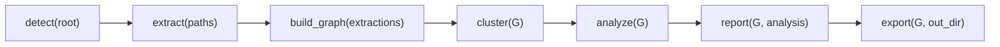

# Graphify 流水线架构

## 1. 主流程

Graphify 官方架构文档将主流程定义为：



代码实现中对应模块如下：

| 阶段 | 模块 | 输出 |
|------|------|------|
| detect | `detect.py` | `{"files": {code/document/paper/image/video}, total_files, total_words}` |
| extract | `extract.py` + `llm.py` | extraction dict：`nodes`、`edges`、`hyperedges` |
| build | `build.py` | NetworkX `Graph` / `DiGraph` |
| cluster | `cluster.py` | `{community_id: [node_id]}` |
| analyze | `analyze.py` | god nodes、surprises、questions、diff |
| report | `report.py` | `GRAPH_REPORT.md` 文本 |
| export | `export.py` / `wiki.py` | JSON、HTML、Obsidian、Wiki、SVG、GraphML、Neo4j |

## 2. 三类提取路径

Graphify 实际有三类输入处理路径：

| 路径 | 输入 | 是否本地 | 说明 |
|------|------|----------|------|
| AST 提取 | 代码文件、Markdown 结构 | 本地 | tree-sitter，多进程并行，无 API 成本 |
| Semantic 提取 | 文档、论文、图片 | 依赖 LLM | 由 skill 子代理或 `llm.py` 后端输出 JSON fragment |
| Media 提取 | 音视频、YouTube | 本地转录 | faster-whisper 转 transcript，再进入语义提取 |

整体思路是：先用 AST 构建“事实骨架”，再用 LLM 为非代码语料补充概念、引用、语义相似关系。

## 3. Extraction Schema

所有提取器最终汇聚到统一 JSON schema：

```json
{
  "nodes": [
    {
      "id": "stable_node_id",
      "label": "Human Name",
      "file_type": "code|document|paper|image|concept",
      "source_file": "path",
      "source_location": "L42"
    }
  ],
  "edges": [
    {
      "source": "node_a",
      "target": "node_b",
      "relation": "calls|imports|uses|references|...",
      "confidence": "EXTRACTED|INFERRED|AMBIGUOUS"
    }
  ],
  "hyperedges": []
}
```

`validate.py` 对 schema 做校验；`build.py` 在构图前还会兼容旧字段，例如把 legacy 的 `links` 映射为 `edges`。

## 4. 置信度模型

Graphify 明确区分三类边：

| 标签 | 语义 | 典型来源 |
|------|------|----------|
| `EXTRACTED` | 源码或文档中明确存在 | import、call、foreign key、显式引用 |
| `INFERRED` | 有证据的推断 | 跨文件调用二次解析、语义关系 |
| `AMBIGUOUS` | 不确定，需人工复核 | LLM 判断不稳或关系弱 |

这个设计很重要：Graphify 不把所有边包装成“事实”，而是把可疑关系保留下来，交给报告和查询层显式暴露。

## 5. 增量更新架构

Graphify 有两种增量能力：

1. **manifest 增量**：`detect_incremental()` 比较 `graphify-out/manifest.json`，识别新增、删除、未变文件。
2. **内容缓存**：`cache.py` 以文件 hash 作为缓存键，AST 与 semantic 分开缓存。

代码变更可通过 `watch.py` 走 AST-only rebuild，不需要 LLM；文档、论文、图片变化会写 `graphify-out/needs_update`，提示用户运行完整语义更新。

## 6. 输出边界

项目约定所有构图产物都落在 `graphify-out/`：

| 文件/目录 | 内容 |
|-----------|------|
| `graph.json` | NetworkX node-link 图 |
| `GRAPH_REPORT.md` | 人类和 Agent 首读报告 |
| `graph.html` | 浏览器交互图 |
| `cache/` | AST / semantic 缓存 |
| `manifest.json` | 增量扫描基准 |
| `converted/` | Office / Google Workspace / transcript sidecar |
| `wiki/` | Agent 可爬取 Markdown Wiki |

