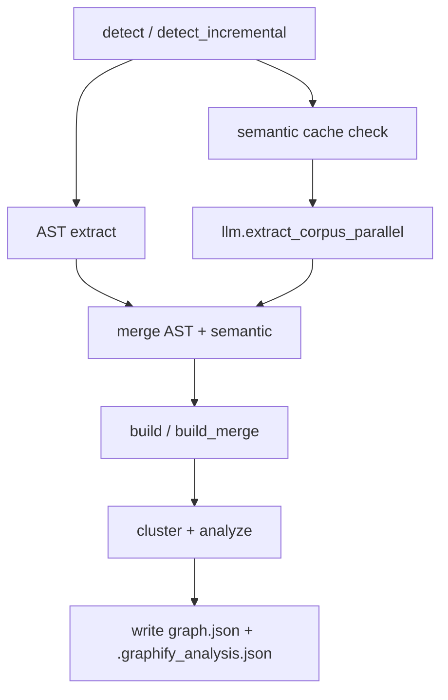

# Graphify CLI 与集成机制

## 1. CLI 总入口

`graphify/graphify/__main__.py` 是 CLI 总入口，承担三类职责：

1. 安装/卸载各平台 skill 与项目指令。
2. 对已有 `graph.json` 执行查询、路径、解释、导出、benchmark。
3. 执行 headless extraction、watch、update、global merge 等工程任务。

命令分发采用手写 `sys.argv` 解析，而不是 argparse/typer/click。好处是依赖少，坏处是 `__main__.py` 已经非常长，命令扩展成本逐步升高。

## 2. 平台安装机制

Graphify 为多个 AI 编程环境提供 skill 文件：

| 平台 | skill 文件 |
|------|------------|
| Claude Code | `skill.md` / `skill-windows.md` |
| Codex | `skill-codex.md` |
| OpenCode | `skill-opencode.md` |
| Aider | `skill-aider.md` |
| Copilot | `skill-copilot.md` / `skill-vscode.md` |
| OpenClaw / Hermes | `skill-claw.md` |
| Kiro / Pi / Droid / Trae | 对应 `skill-*.md` |

安装不仅复制 skill，还会向项目配置文件写入规则：

- Claude：`CLAUDE.md` 与 hooks。
- Codex/OpenCode/OpenClaw：`AGENTS.md`。
- Gemini：`GEMINI.md` 与 `.gemini/settings.json` hook。
- VS Code Copilot：`.github/copilot-instructions.md`。
- Cursor、Kiro、Antigravity 等有各自配置路径。

核心思想是：**构图只是第一步，必须让 Agent 在回答架构问题前优先读图**。

## 3. Hooks 与自动提醒

Graphify 的 hooks 用于把“先读图”嵌入工具调用前：

- Claude/Gemini/Codex 类平台在文件读取、搜索、Bash grep/rg 前提示读取 `graphify-out/GRAPH_REPORT.md`。
- git hook 可在 commit/checkout 后更新或提示更新图。
- merge driver 可对 `graph.json` 做 union merge，减少团队协作冲突。

这是一种轻量但有效的 Agent 行为塑形：不改变模型能力，只改变上下文入口。

## 4. 查询命令

已有图的查询入口：

| 命令 | 说明 |
|------|------|
| `graphify query "..."` | 关键词匹配起点后 BFS/DFS 子图遍历 |
| `graphify path A B` | 两节点最短路径 |
| `graphify explain X` | 节点详情 + 邻居 |
| `python -m graphify.serve graphify-out/graph.json` | MCP stdio server |

查询层的价值不是“回答问题”，而是给 Agent 提供结构化上下文：相关节点、边、来源文件、置信度、社区。

## 5. `watch` / `update`

`watch.py` 体现了成本分层：

- 代码文件变化：本地 AST 重建，无 LLM 成本。
- 文档/论文/图片变化：写 `needs_update`，提示用户跑完整语义提取。

AST-only rebuild 会保留历史 semantic 节点和边，避免代码小改时丢失文档语义关系。

## 6. Headless `graphify extract`

`graphify extract <path>` 是 CI/脚本路径，不依赖 Claude Code skill 子代理。它直接调用：

它支持：

- `--backend gemini|kimi|claude|openai|ollama|bedrock`
- `--model`
- `--out`
- `--no-cluster`
- `--dedup-llm`
- `--google-workspace`
- `--global --as <tag>`

## 7. 集成设计评价

优点：

- 平台覆盖非常广。
- 安装行为不只“装命令”，还负责植入 AI 使用规则。
- MCP server 让图不只是文件，而是可交互工具。

风险：

- `__main__.py` 同时承担安装、查询、导出、构图、global graph，职责膨胀。
- 各平台配置格式散落在同一文件内，未来平台变化会带来维护压力。
- 手写参数解析容易出现边界遗漏，后续可考虑拆命令模块。

