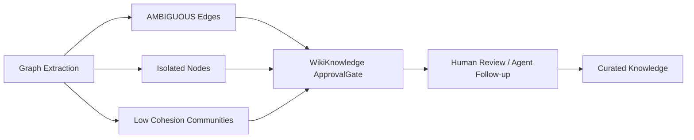

# Graphify 对 Legion 的设计启发

## 1. 对 LLM Wiki 的启发

Graphify 最适合借鉴到 Legion 的部分是 LLM Wiki / 知识图谱层。

可借鉴设计：

| Graphify 机制 | Legion 可用法 |
|---------------|---------------|
| `GRAPH_REPORT.md` | Wiki 构建后生成 Agent 首读报告，包含 god nodes、知识缺口、建议问题 |
| community hubs | 把知识库自动分成主题社区，生成 `_COMMUNITY_*` 导航页 |
| confidence tags | Wiki 边关系保留 `EXTRACTED/INFERRED/AMBIGUOUS`，避免把推断当事实 |
| surprising connections | 周期性发现跨模块、跨文档、跨团队的非显然关系 |
| suggested questions | 自动生成知识库待追问/待澄清问题 |
| graph freshness | 记录构图 commit / source version，提示知识过期 |

## 2. 对 Agent 运行时的启发

Graphify 安装 skill 后会写入助手规则：“回答架构问题前先读图”。这对 Legion Agent 有直接价值：

- Agent 的 `CognitiveCore` 可以把 Wiki/Graph 报告作为 P5 经验上下文。
- `ToolRegistry` 可暴露 `query_graph`、`get_node`、`shortest_path` 这类图查询工具。
- `AgentRuntime` 在执行代码库任务前先查询图，再决定读哪些文件。
- `EvalEngine` 可检测 Agent 是否绕过知识图谱直接盲目搜索。

这相当于把“先导航，再阅读”的行为固化进 Agent 循环。

## 3. 对知识治理的启发

Graphify 的 `AMBIGUOUS` 边与 Knowledge Gaps 很适合映射到 Legion 的知识治理流程：

可形成三类工单：

- 关系确认：某条推断边是否真实。
- 文档补全：孤立节点缺少上下文。
- 模块拆分：低 cohesion 社区是否代表设计边界不清。

## 4. 对实现架构的启发

Graphify 的主流水线可转成 Legion Wiki 的组件拆分：

| Graphify 模块 | Legion 组件候选 |
|---------------|----------------|
| `detect.py` | `CorpusDetector` |
| `extract.py` | `CodeStructureExtractor` |
| `llm.py` | `SemanticExtractor` |
| `build.py` | `KnowledgeGraphBuilder` |
| `dedup.py` | `EntityDeduplicator` |
| `cluster.py` | `KnowledgeClusterer` |
| `analyze.py` | `GraphInsightAnalyzer` |
| `report.py` | `WikiReportGenerator` |
| `serve.py` | `KnowledgeGraphMCP` |

建议 Legion 不复制 Graphify 的“大文件模块”结构，而是在组件层面提前拆细。

## 5. 对安全设计的启发

Graphify 的安全边界适合直接转为 Legion 公共能力：

- SSRF 防护：URL scheme、DNS 解析、redirect、DNS rebinding 全链路检查。
- 敏感文件跳过：默认排除 secrets。
- 输出净化：HTML/YAML/MCP 文本输出统一 sanitize。
- 图路径沙盒：图查询工具只允许读取知识库产物目录。

这些可以归入 `common_components` 的 `SafeFetcher`、`PathGuard`、`OutputSanitizer`。

## 6. 不建议照搬的点

| 不建议照搬 | 原因 |
|------------|------|
| 单个 `extract.py` 承载所有语言 | Legion 长期维护成本会很高 |
| 单个 `__main__.py` 承载所有 CLI | 命令多后难以测试和权限隔离 |
| LLM prompt 直接约束 schema | Legion 应使用更强结构化输出和 schema repair |
| Agent 规则靠写入 Markdown | Legion 可在运行时策略层强制执行 |

## 7. 总结

Graphify 的关键启发不是“生成知识图谱”本身，而是它把图变成了 Agent 的工作入口：

1. 先构建结构化地图。
2. 再生成适合 Agent 首读的报告。
3. 再通过 hooks/skills/MCP 强制或引导 Agent 使用地图。
4. 最后用增量机制保持地图新鲜。

这正好补齐 Legion 中 LLM Wiki 与 Agent Runtime 的连接方式。

