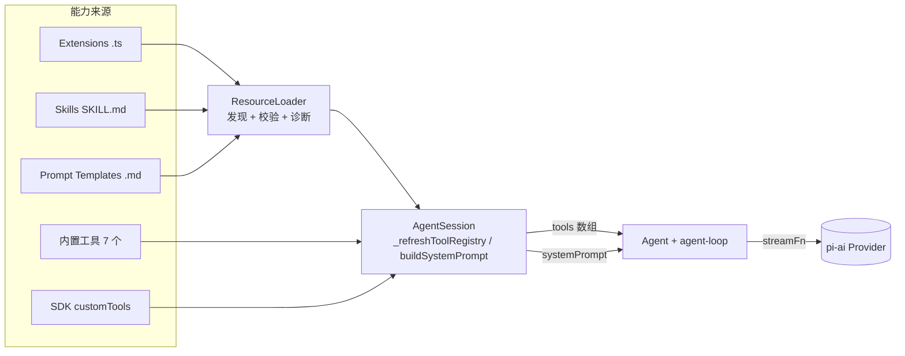

# pi-agent 项目架构总览

<!-- @section: overview -->
## 概述

**pi**（包名 `@earendil-works/pi-*`，仓库 `earendil-works/pi-mono`）是一个 TypeScript/Node 的编码 Agent harness。定位与 Claude Code / Codex CLI 同类，但设计取向相反：**内核最小，扩展点最大**。

分析快照：

| 项 | 值 |
|----|-----|
| 代码路径 | `F:\source\github\pi` |
| 快照 commit | `086c32e` (2026-08-15) |
| CLI 版本 | `@earendil-works/pi-coding-agent` 0.84.2 |
| 语言/运行时 | TypeScript 5.9，Node ≥ 22.19，另发 Bun 单文件二进制 |
| 构建 | npm workspaces + esbuild + biome + tsgo |
| 配置目录 | `~/.pi/agent/`（全局）、`.pi/`（项目） |

一句话概括：**pi 把「工具/技能/扩展」三层能力全部下放给用户代码，用 TypeScript 扩展点取代 MCP 协议，用 Agent Skills 标准文件取代内建工作流。**
<!-- @end-section -->

<!-- @section: packages -->
## Monorepo 包分层

```
packages/
├── ai                 # pi-ai：统一 LLM API（provider/auth/流式/成本），模型目录代码生成
├── agent              # pi-agent-core：Agent 内核 + agent-loop + 新一代 AgentHarness 规范
│   └── src/harness/   #   会话树、reducer、tools、skills、compaction、telemetry
├── coding-agent       # pi CLI 本体：AgentSession 编排、7 个内置工具、扩展系统、TUI/RPC/print 模式
├── tui                # pi-tui：差分渲染终端 UI 框架（组件、主题、编辑器、内联图片）
├── protocol           # 实验性二进制协议：CBOR + 4 字节长度分帧
├── server / client    # 远程会话服务端/客户端（Unix socket、WebSocket 等 ByteTransport）
├── session-backends   # sqlite-node 等会话存储后端（与内核解耦，避免拉入原生依赖）
├── telemetry          # 追踪/指标抽象（含 noop 与内存实现）
└── evals              # 评测 harness
```

依赖方向单向向下：`coding-agent → agent → ai → (tui/telemetry)`。`server/client/protocol` 是并行的远程接入面，不参与 Agent 主循环。

关键分层判断：

- **`packages/agent` 是可复用内核**：只认识 `AgentMessage`、`AgentTool`、`StreamFn`，不认识文件系统、不认识 `.pi` 目录、不认识扩展。任何宿主都能内嵌。
- **`packages/coding-agent` 才是「编码 Agent 产品」**：cwd、工具实现、技能发现、扩展加载、会话文件、TUI 全在这一层。
- 这条边界是 pi 最值得抄的结构决策：**内核不感知能力来源**（见 [[analysis-pi-tools-004]]）。
<!-- @end-section -->

<!-- @section: entrypoints -->
## 入口与运行模式

`packages/coding-agent/src/cli.ts` → `main.ts` 分发到四种模式：

| 模式 | 入口 | 用途 |
|------|------|------|
| interactive (TUI) | `modes/interactive/interactive-mode.ts` | 默认交互式终端 |
| print | `modes/print-mode.ts` | `pi -p "..."` 一次性输出 |
| json-event | `modes/json-event.ts` | 结构化事件流输出 |
| rpc | `modes/rpc/rpc-mode.ts` | stdin/stdout 严格 LF 分隔 JSONL，供非 Node 宿主集成 |

另有 `src/core/sdk.ts` 暴露 `createAgentSession()` / `createAgentSessionRuntime()` 供程序内嵌，以及 `packages/server` + `packages/client` 的远程会话通道（CBOR 二进制协议，握手 `hello` 携带 `PROTOCOL_VERSION`）。

**一个能力，四种外壳**：`AgentSession` 是唯一的编排对象，TUI/print/rpc 只是它的呈现层；扩展通过 `ctx.mode`（`"tui" | "rpc" | "json" | "print"`）与 `ctx.hasUI` 自行降级。
<!-- @end-section -->

<!-- @section: philosophy -->
## 设计取向（README「Philosophy」原文要点）

pi 明确拒绝了一批同类产品的默认功能，每一条都给出「用扩展自己造」的替代路径：

| 拒绝项 | pi 的替代方案 |
|--------|---------------|
| **MCP** | 写带 README 的 CLI 工具（即 Skills），或写扩展自行接入 MCP |
| 子 Agent | tmux 拉起多个 pi 进程，或用扩展实现（`examples/extensions/subagent`） |
| 权限弹窗 | 跑在容器里，或用扩展做确认流（`permission-gate.ts`） |
| Plan Mode | 写文件，或扩展实现（`examples/extensions/plan-mode`） |
| 内建 TODO | 「TODO 会让模型分心」，用 `TODO.md` 或扩展 |
| 后台 bash | 用 tmux，保证可观测与可交互 |

代码取证：全仓库 `mcp` 关键字只有两处，且都不是实现——`packages/ai/src/auth/oauth/anthropic.ts` 的 OAuth scope 字符串 `user:mcp_servers`，以及 `tool-result-images.ts` 注释里把「MCP bridges」列为可能产出图片的**扩展**来源。**pi 没有任何 MCP client/server 代码**，详见 [[analysis-pi-extensions-006]]。
<!-- @end-section -->

<!-- @section: capability-map -->
## 能力装载机制全景（本系列的重点）

pi 有 **四条**把能力送进模型上下文的通路，彼此正交：

| 通路 | 载体 | 进入上下文的方式 | 谁写 |
|------|------|------------------|------|
| **Tools** | `AgentTool` / `ToolDefinition` | JSON Schema 进 tools 数组，模型直接调 | 内核内置 7 个 + 扩展 + SDK |
| **Skills** | `SKILL.md` + 目录 | 启动时只注入 name/description/location，模型用 `read` 按需加载全文 | 用户 / pi 包 / 其他 harness 共享 |
| **Prompt Templates** | `.md` 模板 | `/name args` 显式展开为用户消息 | 用户 / pi 包 |
| **Extensions** | `.ts`/`.js` 模块 | 不进上下文，改变一切（注册工具、拦截事件、换 provider、改 UI） | 用户 / pi 包 |

四者的公共分发单元是 **pi package**（npm/git/本地路径，`package.json` 的 `pi` 字段声明 `extensions/skills/prompts/themes`）。



各通路细节分别见 [[analysis-pi-tools-004]]、[[analysis-pi-skills-005]]、[[analysis-pi-extensions-006]]。
<!-- @end-section -->

<!-- @section: two-harnesses -->
## 一个仓库里的两代 harness

阅读 pi 时最容易踩的坑：**`harness` 这个词在仓库里指两个不同的东西**。

1. **现役 harness**：`coding-agent/src/core/agent-session.ts`（3344 行）+ `agent/src/agent.ts` + `agent-loop.ts`。这是今天真正跑起来的东西，会话以 JSONL 落盘，状态基本在内存。
2. **下一代 `AgentHarness`**：`packages/agent/src/harness/`，有一份 2941 行的实现规范 `packages/agent/docs/harness.md`，定义了 lane（并行车道）、operation 状态机、三种存储（entries/registers/usage ledger）、崩溃恢复。**当前 `agent-harness.ts` 仍是脚手架**——`create()` 遇到已有记录直接抛 `HarnessNotImplemented`，`prompt/steer/compact/...` 全部 `unavailable()`；仅 `session/`、`reducer.ts`、`skills.ts`、`tools/`、`compaction/` 等子模块已落地（对应测试文件名就叫 `agent-harness-scaffold.test.ts`）。

两代的关系、以及 Legion 该抄哪一代，见 [[analysis-pi-harness-003]]。
<!-- @end-section -->

## 相关文档

- [[analysis-pi-index|pi-agent 分析索引]]
- [[analysis-pi-architecture-002|运行时架构与主循环]]
- [[analysis-pi-harness-003|Harness 分层与下一代规范]]
- [[analysis-pi-tools-004|工具系统与装载机制]]
- [[analysis-pi-skills-005|技能系统]]
- [[analysis-pi-extensions-006|扩展系统与 No-MCP 立场]]
- [[analysis-pi-insights-007|对 Legion 的启示]]
