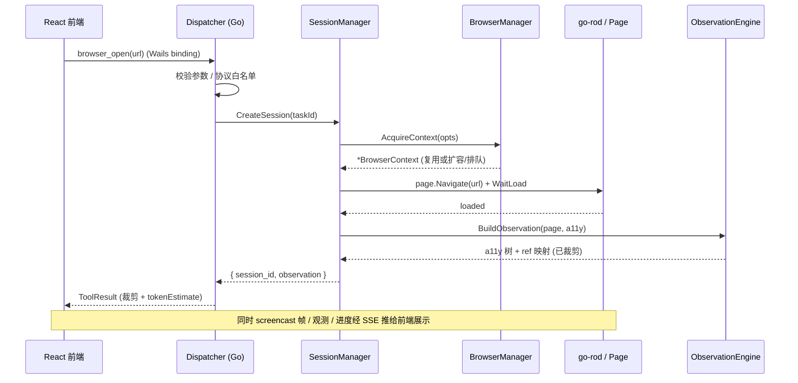
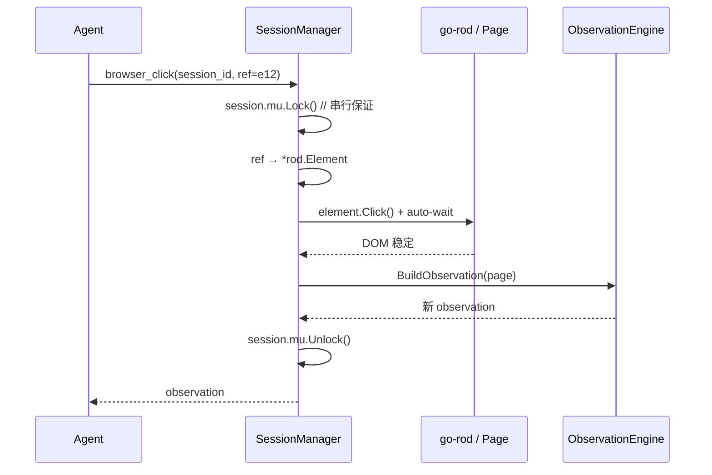

# Agent 内置浏览器子系统设计文档

**版本** v2.4  ·  **日期** 2026-08-04  ·  **状态** 草案

> v2.4 变更：**定案——全程采用 loopback HTTP+SSE**。三种运行模式统一为单一传输路径（HTTP POST 命令 + SSE 推流）；App 模式在进程内起 loopback 服务器，Wails 仅作 webview 宿主。补充 §3.4 loopback 落地细节（endpoint/token 握手、生命周期），清除 Wails Binding 备选表述。
> v2.3 变更：新增 §3.4，厘清 Wails 独立 App 模式下 **Binding+Events vs loopback HTTP+SSE** 的区别与优劣，给出默认推荐。
> v2.2 变更：流式推送通道确定为 **SSE（Server-Sent Events）+ HTTP POST（命令）** 组合，用于**服务器→客户端**的单向推流（当前设计不含多服务互调）；更新 §3 传输适配、§7 时序、§8/§10 相关注意事项。
> v2.1 变更：部署模型从"固定本地内嵌"改为 **API 优先 + 传输解耦**，后端核心一次编写、支持三种运行模式（开发本地 / 独立服务 / Wails 独立 App）。
> v2.0 变更：技术栈由 Node.js 改为 **Go 后端 + go-rod**；据此改写接口、并发模型、资源预算、安全模型与跨平台方案。

---

## 0. 文档说明

本文档描述在 Agent 内部使用的浏览器运行时（Browser Runtime）的设计方案。目标是让 Agent 能像人一样"看网页、点按钮、填表单、下载文件"，同时把资源占用、并发隔离、可靠性和安全边界控制在生产可用的范围内。

**技术栈与形态（已确认）：**

- 后端：**Go 服务**（Agent、工具、浏览器运行时都在这里），**API 优先**——对外只暴露一套稳定 API，内部实现与调用方解耦
- 前端：**Wails + React**；前后端分离，前端只经 API 边界消费
- CDP 驱动：**go-rod**（纯 Go、高层 API、自带等待/重试、无 Node 依赖）
- 传输（**已定，三模式统一**）：命令走 **HTTP POST**（请求/响应），服务器→客户端流式（截图帧/观测/进度）走 **SSE**；App 模式在进程内起 **loopback**（`127.0.0.1`）服务器，前端 `fetch`+`EventSource` 本地自连，Wails 仅作 webview 宿主
- **部署 = 三种运行模式共用一个后端核心**（见 §3）：
  - **开发本地**：后端独立进程跑，前端（或调试脚本/Postman）连 `localhost` 调，便于热重载与断点调试
  - **独立服务**：后端作为服务部署，供**其他/多个前端**通过网络 API 调用
  - **Wails 独立 App**：Wails 把后端 + React 前端打成单个 exe/App 发布给终端用户
- 目标平台：App 模式覆盖 **Windows / macOS / Linux 三桌面端**；服务模式通常 Linux 服务器（见 §11）
- 浏览器内核：Chromium（由 go-rod launcher 拉起，独立于 Wails 自带 WebView）

---

## 1. 设计目标与非目标

### 1.1 目标

一是给 Agent 提供**语义级动作**（打开、点击、输入、读取、下载），而不是暴露裸 DOM 或任意脚本执行。二是把页面**压缩成 token 可控、可定位、可点击**的表示。三是**逻辑会话与物理进程解耦**，进程可复用/回收而不丢登录态。四是**跨会话并发、同会话串行**，兼顾吞吐与状态一致。五是内建**超时、错误规范化、SSRF/沙箱**等生产必需能力。六是**系统层跨三桌面端**：同一套 Go 上层逻辑在 Win/macOS/Linux 行为一致，OS 差异收敛到平台抽象层（见 §11）。七是**API 优先、部署无关**：浏览器运行时全在 Go 后端，对外一套稳定 API；同一后端核心可在开发本地、独立服务、Wails 独立 App 三种模式下运行，切换靠替换传输适配而非改核心（见 §3）。前端能实时观看 Agent 的浏览过程。

### 1.2 非目标

不做通用爬虫调度平台；不追求绕过所有反爬（合规优先）；不提供 `execute_arbitrary_js` 类黑盒工具。多客户端/鉴权在服务模式下需要，但**多租户强隔离与计费**本期不做（见 §13 分叉点）。

---

## 2. 总体架构

浏览器运行时整体落在 **Go 后端**，是一个**自包含、API 优先的核心**；任何前端（Wails 内嵌的 React、独立部署的 Web/桌面客户端、调试工具）都只经统一 API 边界消费，并可接收流式的截图帧/观测更新用于展示。后端核心**不感知自己是被内嵌还是被远程调用**——这由外层的传输适配决定（见 §3）。

```
        任意前端 (Wails 内嵌 React │ 独立 Web/桌面前端 │ 调试脚本)
                          │
        ┌─────────────────┴──────────────────┐
        │  传输层 (统一)：HTTP POST(命令) + SSE(推流) │
        │  App 模式 = 进程内 loopback；服务模式 = 网络 │
        └─────────────────┬──────────────────┘
                          ▼
  Go 后端核心 (Browser Runtime Core, 部署无关)
      Agent  →  Tool Dispatcher  →  { WebSearch , Browser Runtime }
                                        │
    Session Mgr │ Browser Mgr │ Download Mgr │ Observation Engine
                                        │
                                 go-rod (CDP)
                                        │
                   Chromium 进程（自动化目标，独立于 Wails WebView）
                                        │
                   BrowserContext (incognito) ──→ Page / Tab
```

> **关键区分：Wails WebView ≠ 自动化 Chromium。**
> 在 App 模式下，Wails 用系统原生 WebView（Win 上 WebView2、mac 上 WKWebView、Linux 上 WebKitGTK）渲染 React **应用界面**；Agent 要浏览的网页跑在**另一个由 go-rod 通过 CDP 控制的 Chromium 进程**里。两者不共享进程、不共享 cookie，别混。

### 2.1 分层职责一览

| 层 | 位置 | 职责 | 有无状态 |
|---|---|---|---|
| 前端 | Wails WebView / 独立前端 | 交互 UI、展示观测/截图流 | — |
| 传输层 | Go 后端外缘 | 统一 HTTP POST + SSE（App 模式 loopback，服务模式网络） | 无 |
| Tool Dispatcher | Go 后端核心 | 路由、校验、结果裁剪 | 无 |
| Session Manager | Go 后端核心 | 逻辑会话生命周期、登录态持久化、会话内串行锁 | 有 |
| Browser Manager | Go 后端核心 | Chromium 进程 + Context 池、扩缩容、健康检查 | 有 |
| Download Manager | Go 后端核心 | 下载拦截、File Cache、内容寻址去重 | 有 |
| Observation Engine | Go 后端核心 | a11y 树 / Markdown / 截图三种页面表示 + 裁剪 | 无（纯函数） |

---

## 3. 运行模式、传输适配与前后端分离

### 3.1 一个核心，三种运行模式

后端核心（§2 的 Browser Runtime Core）只写一次；**三种模式统一走一套传输：HTTP POST（命令）+ SSE（推流）**，差别只在监听在哪、是否鉴权：

| 模式 | 场景 | 传输 | 后端与前端关系 |
|---|---|---|---|
| **开发本地** | 开发/调试 | HTTP POST + SSE on `localhost` | 后端独立进程，前端/Postman/脚本连本地端口，可热重载、下断点 |
| **独立服务** | 给多个客户端提供能力 | HTTP POST + SSE（带鉴权，走网络） | 后端部署为服务，多个客户端远程调用 |
| **Wails 独立 App** | 打包给终端用户的单 exe | HTTP POST + SSE（进程内 **loopback** `127.0.0.1`） | 后端 + React 同包，前端本地自连；Wails 仅作 webview 宿主 |

**设计要点：核心与传输解耦，且只有一种传输实现。** 核心只依赖一个内部接口（下方 `RuntimeAPI`）；对外只有**一个 HTTP+SSE 适配器**，三种模式复用它，仅监听地址/端口与鉴权策略不同。"开发时独立调试、发布时 Wails 打包、需要时作为服务对外"三件事共用同一条代码路径，不改一行核心。

```go
// 后端核心对外的唯一契约；两种适配器都封装它
type RuntimeAPI interface {
    Open(ctx context.Context, req OpenReq) (Observation, error)
    Read(ctx context.Context, req ReadReq) (Observation, error)
    Click(ctx context.Context, req ClickReq) (Observation, error)
    Type(ctx context.Context, req TypeReq) (Observation, error)
    // …§6 工具面其余方法
    Subscribe(sessionID string) (<-chan StreamEvent, func()) // 截图帧/观测流
}
```

**唯一的 HTTP + SSE 适配器**：命令走 HTTP POST（请求-响应），`Subscribe` 的流走 **SSE**（服务器→客户端单向推送）。三种模式复用这一个适配器——开发本地与服务模式监听在网络接口，App 模式监听在进程内 loopback（见 §3.4）。

**为什么流式选 SSE 而非 WebSocket**：本设计的流（截图帧/观测/进度）是**纯服务器→客户端单向**推送，命令另走 HTTP POST——正好是 SSE 的适用场景。SSE 相比 WS 的好处：跑在普通 HTTP 上、穿 L7 代理/网关无摩擦、**自带断线重连**（客户端凭 `Last-Event-ID` 续传）、实现更轻。这套"POST 发命令 + SSE 收推送"是服务器↔客户端的干净组合。

### 3.2 前后端分离与流式观测

前端只做两件事：发起动作（请求/响应）、展示结果（订阅流）。浏览器逻辑与 UI 彻底解耦，前端可独立于 Wails 存在（这正是"独立服务模式"能给别的前端用的前提）。

用 go-rod 订阅 CDP 的 `Page.startScreencast`，把帧编码为 JPEG/WebP，经 **SSE** 推到前端画在 `<canvas>`/`` 上，形成内嵌的"Agent 浏览器视图"。默认**只读展示**，用户点击不回传浏览器（避免与 Agent 动作打架）；需要人工接管时另设"接管模式"开关（见 §13）。

**SSE 事件模型**：一条 `GET /sessions/{id}/stream` 长连接承载多类事件，用 SSE 的 `event:` 字段区分：

```
event: observation        // 观测更新（JSON）
data: {"refs":[...], ...}

event: frame              // 截图帧
data: {"seq":128,"mime":"image/jpeg","b64":"..."}

event: progress           // Agent 动作进度 / 状态
data: {"action":"click","ref":"e12","status":"done"}

id: 128                   // 供断线后 Last-Event-ID 续传
```

两个要点必须处理：

1. **二进制帧的开销**：SSE 是 UTF-8 文本流，JPEG 帧要 base64（约 +33% 体积）。对策：**限帧率**（如 5~10 fps）、**按需开关**（前端不看视图时停 screencast）、**降质/降分辨率**、只在页面有变化时推。视图对实时性要求不高，这些足够；若将来要高保真高帧率，再对帧单独开一条二进制 WS 旁路，观测/进度仍走 SSE。
2. **断线重连**：客户端带 `Last-Event-ID` 重连，服务端据此**跳过已送帧、补发错过的观测/进度事件**（帧可丢，状态事件不可丢——用小环形缓冲保留最近 N 条状态事件即可）。

**HTTP/2 建议**：SSE 在 HTTP/1.1 下受浏览器"每域名 ~6 连接"限制，同一客户端多会话并流易顶格。服务器与客户端间**优先 HTTP/2**（多路复用，无此限制）。

### 3.3 模式差异带来的横切关注点

同一核心，不同模式在三个横切点上要求不同，后续章节分别处理：

- **鉴权**：App/开发模式基本免鉴权（本机）；服务模式必须加（token/mTLS），见 §10。
- **会话归属**：服务模式下多个前端/客户端并发，`session_id` 需绑定调用方身份，避免串号，见 §10。
- **资源预算**：App 模式按"单机不拖垮用户"；服务模式按"服务器并发容量"，见 §8。

### 3.4 App 模式落地：进程内 loopback HTTP+SSE（定案）

**决策**：App 模式采用**进程内 loopback HTTP+SSE**，不用 Wails Binding+Events。理由是它把三种模式压成一条代码路径、前端能脱离 Wails 用 DevTools 独立调试、SSE 重连逻辑只写一遍——正合"方便调试 + 一套核心多模式"。代价（一个本地监听端口的暴露面、Windows 偶发防火墙弹窗、略高开销）用下面的加固与工程处理消化。

> 备选 Wails Binding+Events 的对比与放弃理由见附录 A（保留作决策记录）。

**启动握手（解决端口/token 的鸡生蛋）**：

```
App 启动
  1. Go 侧选一个空闲端口，绑 127.0.0.1:<port> 起 HTTP+SSE 服务器
  2. 生成一次性 bearer token（进程级，随启动轮换）
  3. 通过唯一保留的一个 Wails 注入点，把 { baseURL, token } 交给前端
     （或 Wails 启动时以 window 全局注入；二选一，只此一处用到 Wails 能力）
  4. 前端之后所有请求：fetch/EventSource 带 Authorization: Bearer <token>
```

> 唯一还沾 Wails 的地方就是这步"握手拿 endpoint+token"；业务通信 100% 走 HTTP+SSE，与服务模式同源。

**加固四件套**（App 模式必做）：只绑 `127.0.0.1`（绝不 `0.0.0.0`）、**随机端口**、每次启动**一次性 bearer token**、校验 `Origin`/自定义头。目的是挡住同机其他进程/其他用户对这个 loopback 端口的越权访问。

**工程处理**：

- **端口冲突**：选口失败就换，重试若干次；把最终 `baseURL` 只经握手告知前端，不硬编码。
- **防火墙弹窗**：绑 `127.0.0.1` 通常不触发；个别 Windows 策略下若触发，随安装包附豁免规则或文档说明。
- **生命周期**：服务器随 App 启停；退出时优雅关闭连接、`Reap` 浏览器进程（见 §9/§11.3）。
- **关键约束提醒**：webview 的 `fetch`/`EventSource` **只能连 TCP**，连不了 Unix socket / 命名管道，所以 loopback 必须是 TCP 端口，无法靠 socket 文件抹掉暴露面——这也是加固四件套存在的原因。

---

## 4. 两个核心概念：Session vs BrowserContext

内置浏览器最常见的坑是把"物理浏览器"和"逻辑会话"混为一谈。本方案严格分离，并对齐 go-rod 概念。

**Session（逻辑）** — Agent 视角的一次浏览上下文，绑定 `task_id`。持有 cookies/localStorage/登录态、tab 列表、动作历史栈。Agent 只认 `session_id`。

**BrowserContext（物理）** — 对应 go-rod 的 **incognito browser**（`browser.Incognito()` 返回的隔离上下文），等价"干净的隐身窗口"，Context 之间 cookie/cache 完全不串。

go-rod 概念映射：

```
launcher 拉起 Chromium 进程
   └─ rod.Browser（一条 CDP 连接 = 一个 Chromium 进程）
        └─ browser.Incognito() → 一个 BrowserContext（隔离）   ← 一个 Session 绑一个
             └─ context.Page()  → 一个 Page/Tab
```

Session 与 Context **解耦**：进程崩溃或被回收后，Session 换一个新 Context 重建，并从持久化的 `storageState` 恢复登录态。进程生命周期独立于会话，是弹性与故障恢复的基础。

---

## 5. 组件详细设计（Go 接口）

### 5.1 Tool Dispatcher（薄路由层）

只做三件事，绝不放业务逻辑：参数校验（类型/必填/URL 协议白名单）、分发、**结果裁剪**（原始返回可能几十万 token，按工具约定截断/摘要后再回给 Agent）。

```go
type ToolResult[T any] struct {
    Data          T      `json:"data"`
    Truncated     bool   `json:"truncated"`      // 是否被裁剪
    TokenEstimate int    `json:"tokenEstimate"`  // 估算 token，供上层预算
    SessionID     string `json:"sessionId,omitempty"`
}
```

### 5.2 Session Manager

```go
type Session struct {
    ID           string
    TaskID       string
    Context      *BrowserContext // 指向物理 Context，回收后为 nil
    Tabs         []*TabState
    ActiveTabID  string
    StorageState StorageState    // cookies + origins，持久化
    ActionLog    []Action        // 供回溯 / 复现
    CreatedAt    time.Time
    LastUsedAt   time.Time
    TTL          time.Duration

    mu sync.Mutex // 会话内串行锁
}
```

职责：CRUD + TTL 空闲回收（归还 Context、落盘 storageState）；登录态持久化（序列化到本地应用数据目录，App 重启可恢复）；**会话内串行**。

> **关键决策：同 Session 内动作串行，跨 Session 才并行。**
> Go 里天然用 `session.mu.Lock()` 保护单会话的动作序列；跨会话各自一个 goroutine 并行跑。页面上"先点开菜单再选项"有顺序依赖，并发点击会导致状态竞争；跨会话无共享状态，可放心并行。

### 5.3 Browser Manager（进程 + Context 两级池）

资源与成本的控制点。用 go-rod 的 `launcher` 自管进程池，池内每个 `rod.Browser` 再开多个 incognito Context。

```go
type ContextOpts struct {
    Proxy        string
    UserAgent    string
    Viewport     Viewport
    Stealth      bool
    StorageState *StorageState
}

type BrowserManager interface {
    AcquireContext(opts ContextOpts) (*BrowserContext, error) // 优先复用空闲，不足再扩容或排队
    ReleaseContext(c *BrowserContext) error                   // 归还前 clearCookies + 关闭 pages
    Reap()                                                    // 回收泄漏 / 僵死进程
}
```

- **进程池**：预热少量 Chromium，避免每次冷启动 300~800ms；按内存水位与 tab 数健康检查，超阈值 graceful 重启（走 PAL 的进程终止）。
- **Context 池**：单进程多 incognito Context，彼此隔离；一进程服务多 Session，成本比"一进程一会话"低约一个量级。

**平台无关**：Browser Manager 不写任何 OS 分支。可执行文件定位、启动参数、进程杀死、内存采样、沙箱包装全部委托 **PAL**（见 §11.2）。

### 5.4 Observation Engine（Agent 场景的核心）

给 Agent 看什么、如何定位元素，直接决定成功率与 token 成本。三种表示按需组合：

| 模式 | 内容 | 定位方式 | 适用 |
|---|---|---|---|
| **A11y / 语义树** | 精简后的可交互元素列表 | 会话内稳定 `ref` id | 默认；token 省、最稳 |
| **DOM / Markdown** | 正文抽取（Readability 类） | CSS / 文本 | 纯阅读、正文提取 |
| **Screenshot** | 截图 + 元素标注框 | 坐标 / set-of-marks | 视觉、canvas、复杂布局兜底 |

**默认 A11y 语义树 + 稳定 ref**：遍历可访问性树（go-rod 可取 CDP `Accessibility` 域），只保留"可交互 + 可见 + 有语义"的节点，为每个分配**会话内稳定**的 `ref`（如 `e12`）。Agent 用 `click(ref="e12")`，而不是猜 CSS selector 或点坐标（后者极脆）。

示例输出：

```
[e3]  <button> 搜索
[e7]  <input>  关键词框  (value="")
[e12] <a href="/item/1"> 商品标题…
```

输出前**预算裁剪**：`max_elements`、按视口/可见性排序、折叠重复列表项，把动辄 50k token 的页面压到 1~3k。

### 5.5 Download Manager + File Cache

用 go-rod 处理 CDP `Browser.setDownloadBehavior` 与下载事件，落到隔离目录。

```go
type DownloadManager interface {
    OnDownload(sessionID string, f RawDownload) FileRef // 存入 cache，返回句柄
    Get(ref FileRef) (io.ReadCloser, error)
    List(sessionID string) []FileMeta
}
```

**File Cache**：按 `session_id` 分区、内容寻址（sha256 去重）、LRU + TTL 清理，落在 PAL 给出的应用缓存目录。返回给 Agent 的是 `file_id` + 元信息（名/类型/大小），**不是路径**——Agent 拿 `file_id` 交给其他工具（解析 PDF、上传等）。大文件设上限，超限直接拒绝并给可读原因。

---

## 6. 暴露给 Agent 的工具面

原则：**动作粒度贴合"人看着页面操作"，一次一个语义动作**；不提供任意脚本执行。这批方法即 Wails Binding 暴露给前端、也是 Agent 的工具集。

```
browser_open(url, session_id?)                → { session_id, observation }
browser_read(session_id, mode?)               → observation        // 默认 a11y 树
browser_click(session_id, ref)                → observation
browser_type(session_id, ref, text, submit?)  → observation
browser_scroll(session_id, direction)         → observation
browser_back(session_id) / browser_forward    → observation
browser_screenshot(session_id)                → image
browser_extract(session_id, schema)           → structured_data    // 内部抽取，省 token
browser_download_list(session_id)             → [file_id, …]
browser_close(session_id)                     → ok
```

两个约定：每个动作执行后**自动附带最新 observation**，省一次"看一下"往返；`browser_extract` 传入 schema，运行时内部完成结构化，避免长页面塞回模型。

---

## 7. 关键时序

### 7.1 打开页面



### 7.2 点击（会话内串行）



### 7.3 会话结束 / TTL 回收

```
任务结束 / TTL 到
  → storageState 落盘（应用数据目录）
  → ReleaseContext：clearCookies + 关闭 pages + 归还进程池
  → Session 标记为可恢复（Context = nil）
```

---

## 8. 资源与并发（随运行模式而变）

内存基数与单进程模型两种模式共用：

```
Mem(process) ≈ BASE + contexts × pages × PAGE
BASE ≈ 200 MB (Chromium 基座，Windows 偏高)
PAGE ≈ 60 MB  (单活跃页面，30~80MB 波动)
```

差别在**并发上限从哪来**，因此用一个可配置的 `ResourcePolicy` 抽象，两种模式注入不同策略：

### 8.1 App / 开发模式：别拖垮用户机器

浏览器**和用户其他程序共享同一台机器**，并发上限来自"单用户同时开的任务数"（通常 1~5）。目标不是堆并发，而是克制。

| 参数 | 默认 | 说明 |
|---|---|---|
| `max_contexts` | 2~4 | 单用户并发会话上限，保守起步 |
| `max_pages_per_context` | 1~2 | 一般一个会话一个活跃页 |
| `mem_budget` | ≤ 系统内存 25% 或绝对上限（如 1.5GB） | 触顶排队，不扩容 |
| 低配机降级 | <8GB 内存收紧到 1 context | 由 PAL `AvailableSystemMemory()` 判定 |

**用 PAL 实测系统内存定预算**而非硬编码；OOM 在用户机器上直接毁体感，比慢更糟。

### 8.2 独立服务模式：服务器并发容量

多前端并发调用，目标是吞吐。回到"进程数 × 每进程 Context 数"的容量模型（预留 20% headroom）：

| 服务器可用内存 | 每进程 ≈560MB(6 ctx) | 最大进程数 | 并发 Session ≈ |
|---|---|---|---|
| 8 GB | 560 MB | ~11 | ~66 |
| 16 GB | 560 MB | ~22 | ~132 |
| 32 GB | 560 MB | ~45 | ~270 |

服务模式还需：**按调用方配额**（防单个前端占满）、全局队列与背压、空闲会话 TTL 回收。CPU 侧经验：每活跃渲染页 0.3~0.7 核峰值。实际以压测为准。

---

## 9. 可靠性设计

**超时分层**：导航超时、动作超时、`networkidle` 等待、整体任务墙钟。任一层超时都返回**可读错误**而非卡死（Go 侧用 `context.Context` 串起 deadline/cancel）。

**自动等待**：go-rod 自带元素可见/可点等待；对 SPA 补一层"DOM 稳定检测"（一段时间无 mutation 视为稳定）。避免裸 `sleep`。

**错误规范化**：把底层异常映射为 Agent 可理解、可自恢复的语义错误：

```
ELEMENT_NOT_FOUND    // ref 失效，建议重新 read
NAVIGATION_TIMEOUT   // 导航超时，建议重试或换策略
BLOCKED_BY_CAPTCHA   // 遇到验证码
DOWNLOAD_TOO_LARGE   // 超出文件上限
CONTEXT_EVICTED      // Context 被回收，需重建 Session
```

**进程健康**：内存/句柄泄漏检测、僵死进程 `Reap`（走 PAL 终止），graceful 重启期间新请求路由到其他进程。

---

## 10. 安全边界（随运行模式收紧）

安全基线两种模式都要；服务模式额外加鉴权与会话归属。

### 10.0 服务模式额外项

- **鉴权**：HTTP POST 与 SSE 入口都必须校验身份（服务模式用 API token / mTLS；App 模式用 §3.4 的一次性 bearer token）。注意 **SSE 是长连接**，除连接建立时鉴权外，长会话要处理 **token 过期/吊销**——可在流内下发 `event: reauth` 要求客户端带新凭证重连，服务端对已吊销的流主动断开。**所有模式监听地址绑 `127.0.0.1`（App/开发）或受控内网接口（服务），绝不无意暴露到 `0.0.0.0`**。注意 App 模式虽是本机，但 loopback 端口同机其他进程可达，故仍需 token + `Origin` 校验，不能免鉴权。
- **会话归属**：`session_id` 绑定调用方身份，跨调用方不可见/不可操作，防串号与越权。
- **配额与限流**：见 §8.2，兼具防滥用与防 DoS。

### 10.1 通用基线

本地/App 形态没有多租户隔离问题，安全重心是两条：**别让 Web 内容逃进宿主机器**，以及**别劫持用户的日常浏览器身份**。

**独立浏览器身份（重要）**：自动化 Chromium **默认用独立的、干净的用户数据目录 + incognito Context**，**不要**直接接管用户日常 Chrome 的 profile——否则 Agent 会带着用户的全部登录态到处点，风险极高。确需登录态时，走"显式授权 + 独立持久化 profile"，且对 Agent 可访问的站点做白名单。

**SSRF / 本地网络防护**：Agent 会打开模型选定的任意 URL，必须禁止其访问用户**本机与局域网**（`localhost`、`127.0.0.1`、`169.254.169.254`、`10./192.168./172.16.` 等私网段）。**DNS 解析后对最终 IP 校验**，防 DNS rebinding。

**协议管控**：拦截 `file://`、`chrome://`、`data:` 等危险协议，防止读本地文件；按业务配置域名白/黑名单。

**沙箱**：Chromium 自身渲染沙箱开启；外层叠加 OS 原生隔离，限制文件系统写入范围到 Session 隔离目录。三平台机制不同，由 PAL 封装（见 §11.3）。

**下载隔离**：下载只落到受控缓存目录，Agent 只拿 `file_id`；不允许 Agent 指定任意落盘路径。

**反检测（可选）**：需要时给 Context 注入 stealth（UA、`navigator.webdriver`、指纹一致性）+ 代理；上线前先明确合规边界。

---

## 11. 系统层：跨平台支持（Windows / macOS / Linux）

目标平台：**App 模式覆盖 Win/macOS/Linux 三桌面端；独立服务模式通常是 Linux 服务器**。核心原则：**上层（Session / Observation / Tool）完全平台无关，所有 OS 差异收敛到"平台抽象层（PAL）"**，用 Go 的构建标签分文件实现，除 PAL 外禁止出现 `runtime.GOOS` 分支。Wails 与 Go 交叉编译本就覆盖三平台，PAL 补齐浏览器进程相关的差异。

> **服务器（无显示器）注意**：服务模式在无头 Linux 上跑，自动化 Chromium 用 `--headless=new` 即可，无需真实显示；截图/screencast 照常工作。若个别站点在 headless 下行为异常，可退到 Xvfb 虚拟显示。镜像需自带 CJK/Emoji 字体（见下表"字体"行），否则截图缺字乱码。桌面 App 模式则有真实显示，automation 浏览器可无头也可有头（调试时有头更直观）。

### 11.1 差异总览

| 关注点 | Linux | macOS | Windows |
|---|---|---|---|
| Wails 应用 WebView | WebKitGTK | WKWebView | WebView2 |
| 自动化 Chromium 定位 | `chrome`/`chromium` | `Chromium.app/.../MacOS/Chromium` | `chrome.exe` |
| 外层沙箱 | 容器/namespaces + seccomp | App Sandbox / `sandbox-exec` | AppContainer + Job Object |
| 进程终止 | `SIGTERM`→`SIGKILL` | 同（POSIX） | `TerminateProcess`（无 POSIX 信号） |
| 内存采样 | `/proc/<pid>` | `task_info` / `ps` | PSAPI `GetProcessMemoryInfo` |
| 应用数据/缓存目录 | `$XDG_*`、`~/.config` | `~/Library/Application Support` | `%LOCALAPPDATA%` |
| 路径分隔符 | `/` | `/` | `\`（内部一律 POSIX，落盘转换） |
| 文件锁语义 | 建议性 | 建议性 | 强制性（占用中不可删/改） |
| 字体 | 桌面一般齐全；精简发行版可能缺 CJK | 齐全 | 齐全 |
| 常驻/自启 | systemd user / desktop entry | launchd | 注册表启动项 / 服务 |

### 11.2 平台抽象层（PAL）

把上表每行差异收敛为一个方法，Browser Manager 与 Download Manager 只调 PAL。Go 惯例：接口在 `platform.go`，实现放 `platform_linux.go` / `platform_darwin.go` / `platform_windows.go`，用构建标签编译。

```go
type PlatformAdapter interface {
    // 进程
    ResolveChromiumPath() string                 // 各 OS 定位可执行文件
    DefaultLaunchArgs() []string                 // 平台相关启动参数
    KillProcess(pid int, graceful bool) error    // 信号 vs TerminateProcess

    // 资源
    SampleProcessMemory(pid int) uint64          // 屏蔽 /proc、task_info、PSAPI 差异
    AvailableSystemMemory() uint64               // 供 §8 桌面预算

    // 文件系统
    AppDataDir() string                          // XDG / ~/Library / %LOCALAPPDATA%
    CacheDir() string
    ToNativePath(posix string) string            // 落盘前转换分隔符
    SafeDelete(path string) error                // 处理 Windows 强制锁：先关句柄/重试

    // 隔离
    WrapWithSandbox(cmd *exec.Cmd) *exec.Cmd     // 见 §11.3
}
```

工厂按 `runtime.GOOS` 选择实现，上层拿到同一接口。

### 11.3 三平台沙箱策略

Chromium 内部已有多进程沙箱；系统层在**外层**叠加 OS 原生隔离，`WrapWithSandbox` 负责封装：

- **Linux** — 优先容器/namespaces 隔离 + seccomp-bpf 收紧系统调用；纯桌面无容器时至少限制文件系统写入目录，`--no-sandbox` 要谨慎评估。
- **macOS** — App Sandbox（打包分发时的 entitlements）为长期方案；`sandbox-exec` 可快速起步但已 deprecated。
- **Windows** — AppContainer 做能力隔离，配合 **Job Object** 限制子进程资源，并用 `JOB_OBJECT_LIMIT_KILL_ON_JOB_CLOSE` 保证 App 退出时连带清理 Chromium，杜绝僵尸进程。

### 11.4 Chromium 分发（桌面 App 特有）

go-rod 的 launcher 默认可**自动下载**一份 Chromium 到缓存目录，但对随 Wails 分发的桌面 App 要在两种策略里选：

- **内置固定版 Chromium（推荐）** — 把固定版本打进 App 资源，`ResolveChromiumPath()` 指向它。版本可控、离线可用、行为可复现；代价是安装包增大约 150~300MB/平台。
- **复用系统已装 Chrome/Edge** — 探测用户已装浏览器并连接。包体小，但版本漂移、用户没装就失败。

建议**内置为主 + 系统为兜底**：优先用内置版，缺失时回退系统浏览器，并把实际使用版本写进日志。首启若走下载模式，需处理无网/被防火墙拦截的降级。

### 11.5 对上层的保证

Session、Observation Engine、Tool Dispatcher、工具面（§6）在三平台**行为与接口完全一致**；Agent 与 React 前端都感知不到底层 OS。§8 的内存基数因 OS 浮动（Windows 偏高），由 `SampleProcessMemory` 实测校正而非硬编码。三平台各建一条 CI，跑同一套端到端用例（open/click/type/download/screenshot），把差异在合入前拦住。

---

## 12. 技术选型建议

**go-rod 作为 CDP 驱动（已定）**：纯 Go、无 Node 依赖、随 Wails 交叉编译到三平台无摩擦；高层 API 自带元素等待/重试，贴合"语义动作"；需要底层能力时可直接发 CDP 命令下探。对比：`chromedp` 更贴 CDP 原语但 auto-wait 等要自己补；`playwright-go` 能复用 Playwright 能力，但底层 driver 是 Node，需随包分发 Node 运行时，体积与依赖更重——与"纯 Go 桌面 App"取向不符。

**进程池自管**：用 go-rod `launcher` 复用进程、控制容量，进程生命周期操作走 PAL。

**服务器↔客户端通道（统一）**：命令走 HTTP POST，流式（截图/观测/进度）走 **SSE**；三种模式复用同一个 HTTP+SSE 适配器，App 模式监听在进程内 loopback（见 §3.4）。选 SSE 而非 WS 的理由见 §3.2。

**持久化**：Session 元数据 + `storageState` + File Cache 落到 PAL 的应用数据/缓存目录；本地形态用嵌入式 KV（如 bbolt/SQLite）即可，无需外部 Redis。

---

## 13. 分叉点（取决于实际场景）

**服务模式升级为多租户强隔离/计费** → §10 的会话归属与 §8 的配额是起点；再往上要一租户一进程甚至一容器、加资源计量与计费埋点，本期不做。

**需要人工接管浏览** → 在 §3.3 的只读展示上加"接管模式"：暂停 Agent 动作、把前端的鼠标/键盘事件回注到 Page。

**纯信息抽取、不需交互** → 砍掉 Session 锁与交互工具，退化为 `navigate + render + extract`，资源大降。

**视觉模型点坐标** → Observation 默认切到 screenshot + set-of-marks，a11y 树降为辅助。

---

## 14. 后续工作（Roadmap 建议）

一是先实现最小闭环：`open / read / click / type + a11y observation + 单进程多 Context`，**以 HTTP/WS 适配器 + 前后端分开跑**的开发模式跑通（最利于调试）。二是打通 SSE 流（observation/frame/progress 三类事件 + Last-Event-ID 重连），让前端看见浏览过程。三是补 Session 持久化与 TTL 回收（嵌入式 KV）。四是让 Wails 作 webview 宿主 + 启动 loopback 服务器（含握手拿 endpoint+token）、打出三平台独立 App；抽出 PAL 打通三平台，建立 CI 矩阵；确定 Chromium 内置/兜底分发策略。五是加安全基线（独立身份、SSRF、三平台原生沙箱），并为服务模式补鉴权/会话归属/配额。六是进程池扩缩容 + 两种资源策略压测。七是按需扩展 screenshot/set-of-marks、接管模式与反检测。

---

## 附录 A：App 传输选型决策记录（Binding+Events vs loopback HTTP+SSE）

App 模式曾在两种接法间取舍，本质区别是**走不走网络栈**。最终选 **loopback HTTP+SSE**（见 §3.4），此表保留作决策记录。

- **Wails Binding + Events**：进程内 webview 原生 IPC。React 调 `window.go.<pkg>.<Method>()`，Go 用 `runtime.EventsEmit` 广播，底层是 webview 消息桥，**不开端口**。
- **loopback HTTP + SSE（选中）**：进程内起 HTTP 服务器绑 `127.0.0.1:<随机端口>`，前端 `fetch`+`EventSource` 连，与开发/服务模式同一套代码。

| 维度 | Binding + Events | loopback HTTP + SSE（选中） |
|---|---|---|
| 代码路径 | 与 dev/服务**是两套** | 与 dev/服务**同一套** ✅ |
| 前端可调试性 | 耦合 `window.go.*` | 纯 HTTP 客户端，DevTools 直连 ✅ |
| 流的重连语义 | 广播 fire-and-forget，补发自造 | SSE 自带 Last-Event-ID ✅ |
| 网络暴露面 | 无监听端口 ✅ | 有 loopback 端口，须 127.0.0.1+token 加固 |
| 防火墙/UX | 无弹窗 ✅ | 个别 Windows 配置或触发弹窗 |
| 性能 | IPC 直传略低 ✅ | 多一层 loopback，命令级可忽略 |
| 二进制帧 | base64 | base64（无本质差异） |
| 生命周期 | Wails 托管 ✅ | 自管端口/启停 |

**取舍**：牺牲"零端口暴露/无防火墙/略低开销"，换取"三模式一条代码路径 + 前端独立可调 + SSE 重连复用"。暴露面用加固四件套（§3.4）消化。若日后安全策略禁止任何本地监听端口，可退回 Binding+Events——因业务都在 `RuntimeAPI` 接口后，切换只动适配器一层。

---

*本文档为 Agent设计 项目的一部分。*
