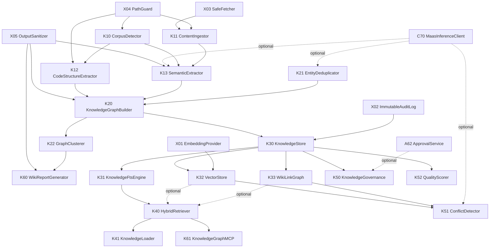

# Know 组件注册表与依赖关系图

## 1. 文档目的

本文档是 LLM Wiki / Knowledge Graph 组件的依赖主表，定义：

1. 每个组件的唯一 ID、层次归属、规格文档
2. 组件间必须依赖与可选依赖
3. minimal / standard / enterprise 装配方案
4. Noop 降级行为

## 2. 组件主表

| ID | 组件 | 层 | 必须依赖 | 可选依赖 | 规范文档 |
|----|------|----|----------|----------|----------|
| K00 | KnowComponentRegistry | K0 | — | — | [know-component-registry.md](./know-component-registry.md) |
| K10 | CorpusDetector | K1 | X04 | X03 | [corpus-detector-spec.md](./corpus-detector-spec.md) |
| K11 | ContentIngestor | K1 | X03, X04, X05 | — | [content-ingestor-spec.md](./content-ingestor-spec.md) |
| K12 | CodeStructureExtractor | K1 | X04 | — | [code-structure-extractor-spec.md](./code-structure-extractor-spec.md) |
| K13 | SemanticExtractor | K1 | X05 | C70, C17 | [semantic-extractor-spec.md](./semantic-extractor-spec.md) |
| K20 | KnowledgeGraphBuilder | K2 | K21 | X05 | [knowledge-graph-builder-spec.md](./knowledge-graph-builder-spec.md) |
| K21 | EntityDeduplicator | K2 | — | C70 | [entity-deduplicator-spec.md](./entity-deduplicator-spec.md) |
| K22 | GraphClusterer | K2 | — | — | [graph-clusterer-spec.md](./graph-clusterer-spec.md) |
| K30 | KnowledgeStore | K3 | X02 | — | [knowledge-store-spec.md](./knowledge-store-spec.md) |
| K31 | KnowledgeFtsEngine | K3 | K30 | — | [knowledge-fts-engine-spec.md](./knowledge-fts-engine-spec.md) |
| K32 | VectorStore | K3 | K30, X01 | — | [vector-store-spec.md](./vector-store-spec.md) |
| K33 | WikiLinkGraph | K3 | K30 | — | [wikilink-graph-spec.md](./wikilink-graph-spec.md) |
| K40 | HybridRetriever | K4 | K31 | K32, K33 | [hybrid-retriever-spec.md](./hybrid-retriever-spec.md) |
| K41 | KnowledgeLoader | K4 | K40 | — | [knowledge-loader-spec.md](./knowledge-loader-spec.md) |
| K50 | KnowledgeGovernance | K5 | K30, X02 | K51, K52, X00, A62 | [knowledge-governance-spec.md](./knowledge-governance-spec.md) |
| K51 | ConflictDetector | K5 | K32, K33 | C70 | [conflict-detector-spec.md](./conflict-detector-spec.md) |
| K52 | QualityScorer | K5 | K30 | K31, K33 | [quality-scorer-spec.md](./quality-scorer-spec.md) |
| K60 | WikiReportGenerator | K6 | K22, X05 | K52 | [wiki-report-generator-spec.md](./wiki-report-generator-spec.md) |
| K61 | KnowledgeGraphMCP | K6 | K40, X04, X05 | — | [knowledge-graph-mcp-spec.md](./knowledge-graph-mcp-spec.md) |

公共组件：

| ID | 组件 | 规范 |
|----|------|------|
| X00 | EventBus | [../common_components/event-bus-spec.md](../common_components/event-bus-spec.md) |
| X01 | EmbeddingProvider | [../common_components/embedding-provider-spec.md](../common_components/embedding-provider-spec.md) |
| X02 | ImmutableAuditLog | [../common_components/immutable-audit-log-spec.md](../common_components/immutable-audit-log-spec.md) |
| X03 | SafeFetcher | [../common_components/safe-fetcher-spec.md](../common_components/safe-fetcher-spec.md) |
| X04 | PathGuard | [../common_components/path-guard-spec.md](../common_components/path-guard-spec.md) |
| X05 | OutputSanitizer | [../common_components/output-sanitizer-spec.md](../common_components/output-sanitizer-spec.md) |

MaaS 稳定端口：

| ID | 组件 | 规范 |
|----|------|------|
| C70 | MaasInferenceClient | [../maas_components/maas-inference-client-spec.md](../maas_components/maas-inference-client-spec.md) |

## 3. 依赖关系图



## 4. 装配方案

### minimal

适用于本地开发和文档少量检索：

```
K10, K12, K20, K21, K22, K30, K31, K33, K40, K41
X02, X04, X05
```

无向量检索、无 LLM 语义提取、无治理工单。

### standard

适用于生产知识库：

```
= minimal
+ K13, K32, K50, K51, K52, K60, K61
+ X00, X01, X03
+ C70(MaasInferenceClient), C17(ContentFilter)
```

启用混合检索、治理、冲突检测、报告与 MCP。

### enterprise

适用于企业多租户与跨项目知识图谱：

```
= standard
+ K11(ContentIngestor)
+ 全量审计、外部 URL/Office/Google Workspace/音视频接入
+ 多项目 Graph Merge 与跨库权限隔离
```

## 5. Noop 降级行为

| 缺失组件 | Noop 行为 | 影响 |
|----------|-----------|------|
| SemanticExtractor | 只构建代码结构图和 Markdown WikiLink | 无文档深层语义边 |
| VectorStore | 向量检索返回空 | HybridRetriever 退化为 FTS + WikiLink |
| WikiLinkGraph | 图遍历返回空 | HybridRetriever 退化为 FTS + Vector |
| ConflictDetector | 所有新知识按无冲突处理，但仍 PendingReview | 需要人工审核兜底 |
| QualityScorer | 默认 quality_score=0.5 | 排序质量下降 |
| WikiReportGenerator | 不生成报告 | Agent 仍可通过 MCP 查询 |
