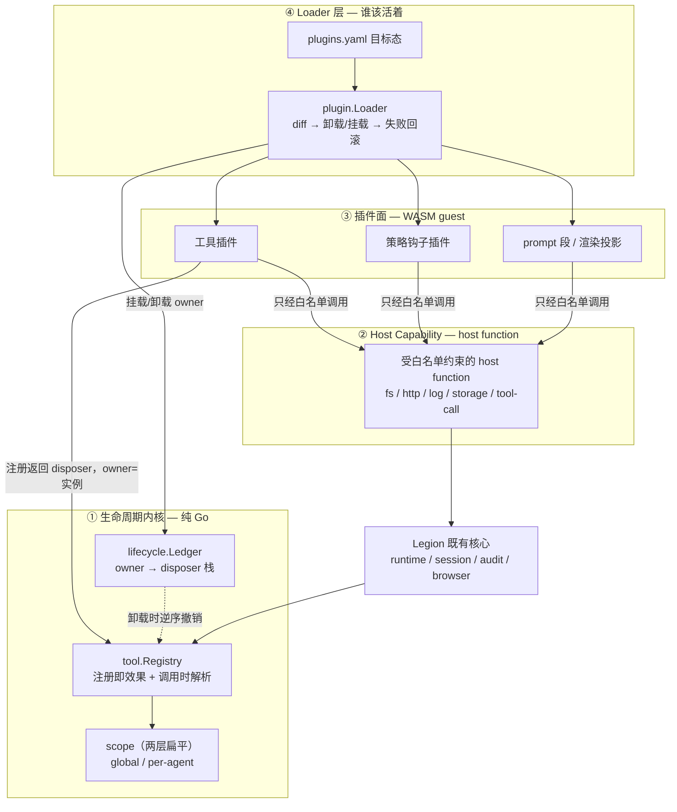
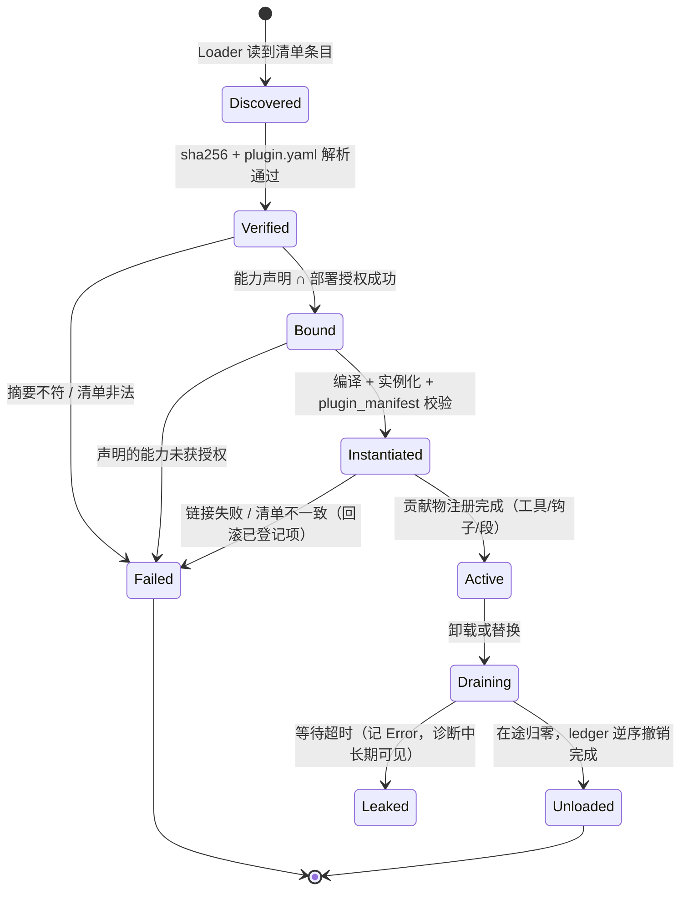

# Legion 插件系统设计方案（借鉴 Cordis）

<!-- @section: overview -->
## 0. 概述

给 Legion 设计一套可动态挂载/卸载的插件系统。核心机制借鉴 Cordis（DSH 底座），但**只借语义，不搬实现**——Go 没有 Cordis，也不需要整套。

**一句话架构**：内核用 owner ledger 记录「谁创建了什么」，注册表全部改为「调用时解析」，Loader 维护「谁该活着」的目标态；插件面用 wazero + WASM 承载不可信代码，能力经 host function 白名单在实例化时物理绑定。

**关键判断**：Cordis 三张表里最重的一张（Service 依赖收敛：提供方消失 → 让 Consumer 退出 → 等旧关系收敛 → 再激活），**Legion 可以直接绕开**。因为 WASM guest 物理上拿不到 host 对象引用，只能持不透明句柄，「Consumer 握着旧 Service 对象」这个问题在 Legion 不成立。

<!-- @end-section -->

<!-- @section: goals -->
## 1. 目标与非目标

### 目标

| # | 目标 | 验收标准 |
|---|---|---|
| G1 | 插件能装进来 | 从清单挂载一个工具插件，模型可调用 |
| G2 | **插件能干净地离开** | 卸载后：工具不在 prompt、调用报 `ErrToolNotFound`、无残留 goroutine/句柄、无幽灵 handler |
| G3 | 挂载失败不留半个现场 | 多步激活中途失败 → 已完成步骤逆序回滚，fail-loud 记录失败步骤 |
| G4 | 不可信插件不能越权 | host function 白名单在实例化时绑定；未授权能力**物理不可达**，不是逻辑过滤 |
| G5 | 失控插件不能拖死宿主 | 每次调用带 deadline；内存有上限；卸载能等待在途调用收敛 |
| G6 | 排查不靠猜 | 插件未生效时可查：清单目标态 vs 实际实例、失败步骤、在途调用数、owner 持有的资源数 |

### 非目标

- 不做 Cordis 的 Fiber 树与 Context 层级覆盖（Legion 用扁平 scope id）
- 不做 Service 依赖收敛 / Consumer 退出重激活（见 §5.5）
- 不做插件市场、签名分发、远程仓库（后续独立议题）
- 不用 `inject` 式依赖声明充当安全边界（Cordis 自己也强调它不是隔离）

<!-- @end-section -->

<!-- @section: borrow -->
## 2. 从 Cordis 借鉴什么

Cordis 的名词（Context / Fiber / Service / effect / Loader）都在回答插件退出时的三个问题。逐条给出 Legion 的对应物：

| Cordis 回答的问题 | Cordis 机制 | **Legion 对应设计** | 借鉴程度 |
|---|---|---|---|
| **系统现在想让哪些插件活着？** | Loader 维护目标插件树；配置删/禁/换 → 处置对应 Fiber；新实例启动失败可恢复旧条目 | `plugin.Loader`：读 `plugins.yaml` → 与实际实例 diff → 卸载/挂载；挂载失败回滚到旧实例并 fail-loud | **全抄** |
| **一个插件创建的资源，退出时该找谁撤销？** | Fiber + `ctx.effect()` 登记 disposer；**所有权跟随调用方 Context**，即使资源放进别人的 Map | `lifecycle.Ledger`：`Add(owner, dispose)` / `DisposeOwner(owner)` 逆序执行；host function 注册的资源，owner = 发起注册的插件实例 | **全抄**（含所有权规则） |
| **某项能力没了，哪些依赖它的插件也不能继续跑？** | Service + `inject`：提供方消失 → 重查 Fiber → 让不满足的 Consumer 退出 → 新实现就绪再激活 | **不实现**。改用「一切走注册表路径」，卸载只删注册项，调用时现取当前实现 | **不抄，绕开** |

另外三条直接采纳：

1. **两条变化路径的区分**（DSH 的核心取舍）：注册表变化只撤销旧注册、调用时再选当前实现；只有会让 Consumer 不再满足启动条件的变化才走重路径。**Legion 的设计目标是让重路径永不出现**（§5.5）。
2. **分步登记退路**（Cordis 的生成器 effect）：每完成一步就把这一步的撤销动作交出去，后续步骤失败时逆序执行已登记的 disposer。Go 里用 undo 栈 + commit 实现（§5.6）。
3. **`ctx.effect()` 的能力边界**：只能回收「已登记且确实可逆」的运行时资源。已发出的网络请求、执行过的命令、写进外部系统的数据不会因插件退出而消失——外部副作用仍需幂等键与补偿。**这条写进插件作者契约。**

<!-- @end-section -->

<!-- @section: current-state -->
## 3. 现状体检（2026-08-16，legionAgent 仓）

| 三问 | Legion 现状 | 证据 |
|---|---|---|
| 谁该活着 | **无**。装配硬编码，无热重载 | `internal/app/app.go`（394 行）；全仓 `grep -rn "Reload"` 零命中 |
| 资源归谁撤销 | **半有**。有单点 disposer 雏形，无中心账本 | `EventBus.Subscribe` 返回 `func()`（`internal/observability/eventbus.go:89`）；其余靠各自 `Close()`，配对全靠人在 app.go 手写 |
| 依赖失效影响谁 | **无**（问题尚未出现，因为没有动态替换） | — |

两处必须先修的结构性缺陷：

**缺陷 A：`tool.Registry` 注册单向、无撤销。**
`internal/tool/registry.go` 只有 `Register` / `RegisterDescriptor`，没有 `Unregister`，也不返回 disposer。插件一旦能卸载，注册项必然泄漏。

**缺陷 B：`Subset()` / `Without()` 是快照拷贝，天然制造幽灵。**
`registry.go:82` 把 handler 复制进新 registry。今天无害（无人卸载），插件能卸载后立刻变成：

```text
插件 X 注册 tool_foo
  → agent A 创建时 Subset() 拷走 handler
  → 插件 X 卸载，主 registry 删掉 tool_foo
  → agent A 的子 registry 仍握着旧 handler，照常执行   ← 幽灵
```

**附带缺陷 C**：`Registry` 无锁。`handlers` map 目前只在启动期写入，动态注册/卸载后会与 `Execute` 的读并发，必须加 `sync.RWMutex`（`-race` 可验证）。

<!-- @end-section -->

<!-- @section: architecture -->
## 4. 总体架构



四层职责：

| 层 | 职责 | 是否依赖 WASM |
|---|---|---|
| ① 生命周期内核 | owner 账本、注册即效果、调用时解析、扁平 scope | **否**（可独立交付） |
| ② Host Capability | 把 Legion 既有能力包成受控 host function；白名单实例化时绑定 | 是 |
| ③ 插件面 | guest 侧：工具、策略钩子、prompt 段、渲染投影 | 是 |
| ④ Loader | 目标态清单、diff、挂载/卸载编排、失败回滚 | 部分（内核阶段可先管 Go 内建 owner） |

**分期依据**：① 是 ②③④ 的前提，且**本身就能独立交付价值**（修掉缺陷 A/B/C，把现有手工 Close 收进账本）。

<!-- @end-section -->

<!-- @section: kernel -->
## 5. 核心机制设计

### 5.1 `lifecycle.Ledger` —— 谁负责撤销

```go
// Package lifecycle owns the answer to "who revokes this resource".
package lifecycle

// Owner identifies whoever created a resource: a plugin instance id, an agent
// session id, or a static assembly name. Compared by value.
type Owner string

// Ledger records revocation actions grouped by owner. It never decides WHAT a
// disposer does — the creator supplies that — only who must run it and when.
type Ledger struct { /* mu sync.Mutex; entries map[Owner][]entry */ }

// Add registers dispose under owner and returns a one-shot handle that runs it
// immediately and removes it from the ledger.
func (l *Ledger) Add(owner Owner, label string, dispose func() error) func() error

// DisposeOwner runs every disposer registered under owner in reverse
// registration order and clears it. Every disposer runs even when an earlier
// one fails; the returned error joins the failures (errors.Join).
func (l *Ledger) DisposeOwner(owner Owner) error

// Snapshot reports live entries per owner, for diagnostics.
func (l *Ledger) Snapshot() map[Owner][]string
```

设计要点（每条都对应一个曾经踩过的坑）：

1. **逆序执行**：与 Cordis 一致。先开的后关。
2. **一个 disposer 失败不阻断其余**：否则一次失败留下更多幽灵。失败必须按 fail-loud 铁律记 `Error` 级日志并汇总返回 `errors.Join`，**不得静默吞掉**。
3. **`Add` 返回一次性句柄**：调用方可以提前撤销单项（对应 Cordis `ctx.effect()` 返回 disposer），重复调用无副作用。
4. **所有权跟随创建者，不跟随存放位置**：插件 X 通过 host function 把 provider 塞进 host 的 map，disposer 记在 X 名下。host 组件只管表和调用时选择，不维护「谁来过谁走了」的通讯录。

### 5.2 `tool.Registry` 改造 —— 注册即效果

```go
// Register 现签名（保持向后兼容的新返回值）
func (r *Registry) Register(name string, handler Handler) func()
func (r *Registry) RegisterDescriptor(d Descriptor, h Handler) func()
```

- 返回值是撤销函数。既有 22 处调用点（`internal/tool/*.go`、`internal/runtime/*_tool.go`、`app.go:157`）改为 `_ = registry.Register(...)`，**零行为变化**。
- 内部加 `sync.RWMutex`：动态注册/卸载与 `Execute` 并发安全（缺陷 C）。
- 重名注册**fail-loud**：返回错误或 panic（启动期不变量），不得静默覆盖——否则两个插件抢同一个工具名会变成玄学。

### 5.3 `Subset` / `Without` 改造 —— 调用时解析

由「拷贝快照」改为「持父引用 + 过滤视图」：

```go
type Registry struct {
    parent *Registry // nil = root
    filter *filter   // nil = root；allow / deny 名单
    own    map[string]Handler // 本作用域自有注册，豁免过滤
    // ...
}
```

解析规则（照抄 dsh 的 scope 语义）：

1. 先查本作用域 `own`——**自有注册豁免过滤**，因为委派出去的子 agent 必须保留它自己应答的工具。
2. 否则向 `parent` 解析，再套 `filter`：`allow` 名单式排除未列出的后续新增工具；`deny` 名单式放行未列出的后续新增工具。
3. 被过滤掉的工具**既不出现在 `Descriptors()`（不进 prompt），也在 `Execute` 时报 `ErrToolNotFound`**——与「不存在」不可区分。这条是硬要求：模型看得见却调不动是最糟的状态。
4. 父级注册被撤销后，子视图**立即**看不到它——幽灵消失（缺陷 B 的直接解法）。

### 5.4 `plugin.Loader` —— 谁该活着

```go
type Loader struct { /* ledger *lifecycle.Ledger; host *Host; ... */ }

// Apply reconciles the running instance set toward the manifest:
//   diff → dispose removed/changed owners → activate added/changed
// An activation failure rolls that instance back (§5.6) and, when it replaced a
// previously running instance, restores the previous one. Apply returns the
// joined failures; it never leaves a partially applied manifest unreported.
func (l *Loader) Apply(ctx context.Context, manifest Manifest) error
```

- 目标态来自 `plugins.yaml`（条目：name / source / version / enabled / config / capabilities）。
- **条目 `enabled: false` 与条目被删除，行为一致**：卸载。
- **挂载失败必须回滚到旧实例**，与 Cordis Loader 一致；失败原因（哪一步、已回滚哪些）进事件流（§8）。
- 触发方式两种：启动期一次 `Apply`；运行期由显式命令/HTTP 触发（**先不做文件 watcher**——热重载的复杂度留到确有需求时）。

### 5.5 依赖收敛：简化三态，但必须做

> ⚠️ **本节 v1 的结论（「不做依赖收敛」）是错的，已被 spike 推翻。** 保留原推理于下，因为它错在一个值得记住的地方。

原推理：DSH 有两条路径——注册表路径（轻）与 Service 拓扑路径（重，让 Consumer 退出等收敛）。重路径存在的唯一理由是 **Consumer 可能已经把旧 Service 留在闭包、缓存或内部状态里**；而 Legion 的插件是 WASM guest，**物理上拿不到 host 对象引用**，只能持有不透明句柄，每次调用经 host function 现取当前实现。故前提不成立。

**错在哪：** guest 拿不到 host 引用，只免除了「卸载后旧引用还在被调用」（幽灵），**不免除「依赖不满足时插件仍在运行」（半残）**。B 依赖 A 提供的能力，A 被卸载后 B 的每次调用都会拿到 `UNAVAILABLE`——它不是幽灵，是一个还活着、还在被模型看见、但每次都失败的工具。这正是 Cordis 第三问要回答的。

**结论：要做，但可以简化成三态**（`Active` / `Suspended` / `Unloaded`），不需要 DSH 的完整 Service 拓扑：

| 事件 | 动作 |
|---|---|
| A 卸载/失败 | 依赖 A 的 B 转 `Suspended`：撤销 B 的全部贡献物（工具从目录消失），但保留 B 的实例与状态 |
| A 恢复 | B 转回 `Active`：重新注册贡献物 |
| 级联 | 依赖 B 的 C 同样转 `Suspended`，逐级传播 |

spike 已验证机制可行：12 个用例 + 5 项变异全过，含三级级联挂起、热替换时的在途调用、激活失败回滚。

`Suspended` 而非直接卸载的理由：依赖方的不可用往往是暂时的（热替换的中间态就是一次「卸载再加载」），保留状态让恢复是重新注册而不是重新初始化。

对应地，仍必须封死两个会把「幽灵」问题重新引入的口子（**列为架构不变量，写进 review checklist**）：

- **不变量 I1**：`Registry` 的任何派生视图不得拷贝 handler，只能持父引用（§5.3）。
- **不变量 I2**：host 侧组件不得缓存插件返回的对象/闭包，只能缓存 id；跨调用状态一律放 host 自己的存储并按 id 取。

### 5.6 分步激活与回滚

插件激活是多步的：实例化 → 注册工具 → 注册 prompt 段 → 打开外部句柄。任一步失败都可能留下半个现场。Go 版的「生成器 effect」：

```go
func (h *Host) activate(ctx context.Context, spec Spec) (err error) {
    owner := lifecycle.Owner(spec.InstanceID)
    committed := false
    defer func() {
        if !committed {
            if derr := h.ledger.DisposeOwner(owner); derr != nil {
                h.logger.Error("plugin activation rollback failed",
                    "owner", owner, "step", spec.FailedStep, "err", derr)
            }
        }
    }()

    inst, err := h.instantiate(ctx, spec)          // step 1
    if err != nil { return fmt.Errorf("instantiate %s: %w", spec.Name, err) }
    h.ledger.Add(owner, "wasm-instance", inst.Close)   // 立刻交出退路

    if err := h.registerTools(owner, inst); err != nil { // step 2（内部逐项 ledger.Add）
        return fmt.Errorf("register tools %s: %w", spec.Name, err)
    }
    if err := h.registerSections(owner, inst); err != nil { // step 3
        return fmt.Errorf("register sections %s: %w", spec.Name, err)
    }
    committed = true
    return nil
}
```

要点：**每完成一步立刻把该步的撤销动作交给 ledger**，而不是「最后记得清理」。失败不会体贴地等到最后一步。

### 5.7 在途调用收敛（Go 特有，Cordis 帮不上）

卸载时可能有 WASM 实例正在执行。方案：

- 每个实例维护 `inflight` 计数 + `closing` 标志（`sync.WaitGroup` + `atomic.Bool`）。
- 置 `closing` 后新调用直接返回 `ErrPluginUnloading`；`ctx` cancel 已在途的调用；`WaitGroup.Wait()` 带上限（如 5s）。
- **超时视为 fail-loud**：记 `Error`，标记该 owner 为 `leaked`，在诊断输出里长期可见——绝不静默丢弃。

<!-- @end-section -->

<!-- @section: wasm -->
## 6. WASM 插件机制

### 6.1 选型：自研精简 ABI on wazero

运行时选 **wazero**（纯 Go 无 CGO，保住 Legion 多平台构建矩阵与 Wails 打包）已无争议。有争议的是**是否套 Extism**：

| | 路线 A：Extism go-sdk | **路线 B：自研 ABI on wazero（采纳）** |
|---|---|---|
| guest 工具链 | **TinyGo**（官方：TinyGo 是编译 Extism Go 插件的最佳方式；<0.34 不支持 Reactor） | **标准 Go 1.24+**（`GOOS=wasip1` + `//go:wasmexport` + `-buildmode=c-shared`） |
| guest stdlib | TinyGo 子集，**`reflect` 受限** | 完整 |
| protobuf 编解码 | **有风险**：protobuf-go 重度依赖 `reflect` | 无风险 |
| 多语言 PDK | 现成（7+ 语言） | 需自己提供或后续加一层 |
| manifest / 限额 | 现成（`timeout_ms` / `max_pages` / `allowed_hosts` / `allowed_paths`） | 自己定义（字段设计照抄 Extism） |
| 内存搬运 | PDK 代劳 | 自己写 `alloc`/`free` 约定（wazero 文档有标准做法） |
| 产物体积 | 小（几百 KB） | **大（2–10MB）** |
| CI 工具链 | 多一个 TinyGo | 无新增 |

**决策：路线 B。** 决定性理由是 **TinyGo 的 `reflect` 限制与 protobuf 强类型契约相冲突**——而强类型契约是本方案对齐 dsh Typert 的核心（构建期生成、签名漂移编译期就炸）。为了保住它去赌 TinyGo 的 reflect 兼容性，不如自己写一层 200 行的内存约定。次要理由：插件作者主体是 Go 团队，标准 Go 的完整 stdlib（`regexp` / `encoding/json` / `net/url` / `crypto` / `time`）对写工具插件价值直接。

**接受的代价**：

① ~~失去多语言 PDK~~ — **spike 已消解**：同一份 host（约 190 行）跑通了 Go 与 **Rust** 两种 guest，Rust 产物 68KB / 9µs / 4MiB。多语言不需要 Extism，写一份同协议 SDK 即可。

② `.wasm` 产物：标准 Go guest 实测 **3.26MB**，内存下限 **8MiB**（4MiB 下第 692 次调用 OOM）。缓解：`-ldflags="-s -w"`、插件包内 gzip、wazero 编译缓存复用；体积敏感的插件写 Rust。

**TinyGo：已排除，无回退条件**（2026-08-17 决定）。

原本写的回退条件是「若出现必须支持非 Go 语言的硬需求，且届时 TinyGo 的 reflect 能跑通 protobuf-go，则改走路线 A」。**它的前提已经不成立**——多语言需求被 Rust guest 直接满足了，与 TinyGo 无关；而 protobuf 本身也已在 §6.2 被 JSON + JSON Schema 取代。两个触发条件都消失，这条回退作废。

因此：不再评估 TinyGo，不再补测，`.wasm` 体积成为分发瓶颈时也不回头找它——用压缩与编译缓存，或让作者改写 Rust。

**明确不做**：Component Model / WIT。wazero 尚未实现 WASI p2，标准 Go 编译器不支持 CM。

### 6.2 插件包与清单

一个插件是一个目录（或 tar），内含：

```text
my-plugin/
  plugin.yaml      # 清单：身份、能力声明、贡献物声明
  plugin.wasm      # 编译产物
```

`plugin.yaml`（**由 host 解析，不执行任何插件代码**）：

```yaml
name: legion-jira            # 全局唯一
version: 1.2.0               # semver
abi: 1                       # 本插件编译时依据的 ABI 版本
sha256: "9f2c…"              # plugin.wasm 的摘要，加载时校验
capabilities:                # 声明所需能力，见 §6.4
  - log
  - http
  - kv
limits:                      # 上限申请，host 取 min(申请, 部署上限)
  timeout_ms: 5000
  max_memory_pages: 256      # 256 * 64KiB = 16MiB
  max_instances: 2
network:
  allowed_hosts: ["jira.example.com"]
filesystem:
  allowed_paths: []          # 空 = 不授予任何路径
```

`plugins.yaml`（部署侧目标态，Loader 读它，见 §5.4）：

```yaml
plugins:
  - name: legion-jira
    source: ./plugins/legion-jira      # 目录或 .tar
    enabled: true
    grant:                              # 部署授权，与插件声明取交集
      capabilities: [log, http]         # 注意：未授 kv
      allowed_hosts: ["jira.example.com"]
    config:                             # 传给插件的配置，纯 JSON 数据
      project_key: "OPS"
```

**声明 ⊄ 授权 时的行为：fail-loud 拒绝加载**，错误明确指出缺哪个能力（`plugin legion-jira requires capability "kv" which the deployment does not grant`）。不静默降级——一个以为自己有 KV 的插件半残地跑起来，比不跑更糟。

`plugin.wasm` 里还有一个**权威**清单：`plugin_manifest()` 导出返回的 protobuf。`plugin.yaml` 是给人和 Loader 看的，`plugin_manifest()` 是给 host 校验的；**两者不一致 = 拒绝加载**（防止清单谎报能力或贡献物）。

### 6.3 ABI v1

#### 内存约定

标准 wazero 做法：guest 导出分配器，host 借用。

| guest 必须导出 | 签名 | 语义 |
|---|---|---|
| `plugin_alloc` | `(size i32) -> i32` | 返回 guest 线性内存偏移；**分配的内存必须被 guest 侧钉住**（存进全局 map），否则 Go GC 会回收，host 写入即越界 |
| `plugin_free` | `(ptr i32, size i32)` | 解除钉住 |
| `plugin_manifest` | `() -> i64` | 高 32 位 = ptr，低 32 位 = len，指向 protobuf 编码的 `PluginManifest` |
| `plugin_invoke` | `(op i32, ptr i32, len i32) -> i64` | **唯一业务入口**，同样返回 packed ptr/len |

调用序列（host 侧）：

```text
1. ptr  = guest.plugin_alloc(len(req))
2. mem.Write(ptr, req)                       // req = protobuf 编码的请求
3. packed = guest.plugin_invoke(op, ptr, len(req))
4. resPtr, resLen = unpack(packed)
5. res = mem.Read(resPtr, resLen)            // 立刻拷出，不持有 guest 内存
6. guest.plugin_free(ptr, len(req))
7. guest.plugin_free(resPtr, resLen)
```

第 5 步**必须立刻拷贝**：guest 内存随下一次调用可能增长搬迁，host 持有的 `[]byte` 视图会失效。

#### 单入口 + op 码

`plugin_invoke(op, …)` 用枚举分发，而非每种钩子一个导出：

| op | 名称 | 请求 → 响应 |
|---|---|---|
| 1 | `OP_TOOL_EXECUTE` | `ToolCallRequest` → `ToolCallResponse` |
| 2 | `OP_HOOK_PRE_TOOL` | `PreToolRequest` → `PreToolDecision` |
| 3 | `OP_HOOK_POST_TOOL` | `PostToolRequest` → `ToolCallResponse` |
| 4 | `OP_RENDER_SECTION` | `RenderSectionRequest` → `RenderSectionResponse` |

**理由**：host 将来新增钩子类型（op=5）时，老插件遇到未知 op 返回 `UNSUPPORTED_OP`，不会因为缺少导出而链接失败。ABI 版本号只在**已有 op 的报文结构不兼容变更**时才递增。

#### 报文与错误

所有请求/响应都是 protobuf（`internal/plugin/proto`，由 `.proto` 生成 host 与 guest 两侧代码）。响应统一带信封：

```protobuf
message Envelope {
  oneof result {
    bytes payload = 1;      // 成功：具体响应消息
    PluginError error = 2;  // 插件自己判定的业务失败
  }
}
message PluginError {
  string code = 1;          // 插件定义的稳定错误码
  string message = 2;
}
```

**区分两类失败**（对应 §6.9 的分类）：`PluginError` 是插件正常工作的产物（如「Jira 返回 404」），走工具结果的 `isError` 路径；wasm trap / ABI 解码失败 / 超时是**插件故障**，走 `plugin/call_failed` 事件并计入健康度。

### 6.4 Host Capability 目录

host function 全部注册在模块名 `legion` 下。**未授权的能力根本不注册进该模块**——不是运行时拒绝，是链接期缺失。

| 能力 | host function | 签名（均 packed i64 返回） | 授权 |
|---|---|---|---|
| `log` | `log(level i32, ptr i32, len i32)` | 无返回 | 默认授予 |
| `config` | `config_get() -> i64` | 返回部署侧 `config` 的 JSON | 默认授予 |
| `kv` | `kv_get(k…) -> i64` / `kv_put(k…, v…) -> i64` | 插件私有命名空间 | 需声明 |
| `http` | `http_request(ptr,len) -> i64` | 请求/响应为 protobuf | 需声明 + `allowed_hosts` |
| `fs` | `read_file(ptr,len) -> i64` | 路径必须落在 `allowed_paths` 内 | 需声明 + `allowed_paths` |
| `tool` | `call_tool(ptr,len) -> i64` | 调用宿主已注册工具 | 需声明 + **递归深度上限** |

三条实现约束：

1. **能力检查在 host 侧再做一次**。`allowed_hosts` / `allowed_paths` 不能只靠「没授权就不注册函数」——授权了 `http` 但目标域名不在白名单，必须在 `http_request` 内部拒绝并返回 `DENIED`，同时发 `plugin/call_failed{category:denied}` 事件。
2. **`call_tool` 必须防环**。调用链上携带深度计数，超过上限（默认 3）直接拒绝；且插件发起的工具调用**照常经 `tool.Registry.Execute`**，权限、审计、超时、人工审批门全在原路径上，不给插件开后门。
3. **host function 内若要回写数据给 guest，需调用 guest 的 `plugin_alloc`**。wazero 已知问题：一个 host function 调用另一个 host function 会丢失 memory 访问——因此 host function 之间不得互相调用，公共逻辑抽成普通 Go 函数。

启动时 host 主动比对 module 的 import 列表与已授权集合，缺失时给出人类可读错误，而不是让 wazero 抛晦涩的 link error。

### 6.5 实例模型与并发

| 决策 | 选择 | 理由 |
|---|---|---|
| 实例生命周期 | **长驻 reactor**，非每调用新建 | 实例化开销大（标准 Go wasm 初始化几十 ms） |
| 并发 | 每实例**串行**，实例池做并发（默认 1，`max_instances` 可配） | wasm 实例非线程安全；池化用带缓冲 channel 做信号量 |
| 跨调用状态 | **契约禁止依赖** | 调用可能落到池中任一实例；需要状态用 `kv_*`。同一实例内 guest 全局变量确实会保留，但那是实现细节，不是契约 |
| 编译缓存 | wazero compilation cache 复用 | 同一 `.wasm` 多实例只编译一次 |

```go
// instance pool：取不到实例即排队；closing 后直接拒绝
type pool struct {
    free    chan *instance
    closing atomic.Bool
    inflight sync.WaitGroup
}
```

### 6.6 生命周期状态机



`Instantiated → Active` 之间的多步注册，用 §5.6 的 undo 栈；任一步失败退回 `Failed` 并逆序回滚。

### 6.7 调用路径

工具调用（模型侧看不出与内建工具的差别）：

```text
模型 tool_call
  → tool.Registry.Execute（权限 / 策略 / guardrails / 超时 / 审计，全在原路径）
    → pluginHandler.Execute
      → pool.acquire()（closing 则 ErrPluginUnloading）
      → ctx = WithTimeout(min(descriptor.Timeout, plugin.limits.timeout_ms))
      → 编码 ToolCallRequest → alloc/write → plugin_invoke(OP_TOOL_EXECUTE)
      → 读回 Envelope → 立刻拷贝 → free
      → 解码：payload → domain.ToolResult；error → isError 结果
    → pool.release()
  → sanitizer / audit（原路径）
```

策略钩子（waterfall 的 WASM 降级形态，见 §2）：host 持有钩子链，逐个调用 guest 返回 `PreToolDecision{allow|deny|ask}`，**返回非 allow 即短路**——放弃「包装参数再委派」的 around 语义，只保留决策与可选改写。around 生命周期（超时/重试/指标）仍留 host 原生。

### 6.8 资源限制与失控处置

wazero **没有 fuel 计量**，全靠自己兜：

| 风险 | 措施 |
|---|---|
| 纯计算死循环 | 每调用 `context.WithTimeout` + 运行时 `WithCloseOnContextDone(true)`。**不开这个标志，取消只在下一个操作边界才被观察到**，纯计算循环观察不到 |
| 内存膨胀 | 实例化时设 `max_memory_pages`（取 min(插件申请, 部署上限)） |
| 大结果跨边界拷贝 | 超阈值走「落盘 + 返回定位符」（对齐 Legion 既有截断治理与 dsh 的 spill seam），**不让大 blob 进 guest 线性内存** |
| 实例爆炸 | `max_instances` + 池上限；编译缓存复用 |
| 卸载卡住 | §5.7 的 drain 超时 → 标记 `Leaked` 并在诊断中长期可见，绝不静默丢弃 |

### 6.9 错误分类

`plugin/call_failed` 事件的 `category`，同时驱动插件健康度：

| category | 含义 | 计入故障 |
|---|---|---|
| `plugin_error` | guest 正常返回 `PluginError` | 否（业务结果） |
| `timeout` | 超过调用 deadline | 是 |
| `trap` | wasm trap：越界、`unreachable`、除零 | 是 |
| `abi` | 编解码失败、返回槽非法、`alloc` 返回 0 | 是 |
| `denied` | host function 因能力/白名单拒绝 | 是（但属插件越界，不属故障——单独计数） |

连续故障超阈值 → 自动置该插件为 `Failed` 并卸载，发事件。**不做自动重试**：重试一个 trap 的插件通常只是重复 trap。

### 6.10 插件作者视角（guest SDK）

提供 `pkg/legionplugin`（标准 Go，可被 `GOOS=wasip1` 编译），把 §6.3 的内存与分发细节全部隐藏：

```go
package main

import "github.com/stardust/legion-agent/pkg/legionplugin"

func main() {}   // reactor 模式下不执行

func init() {
    legionplugin.Manifest(legionplugin.Meta{
        Name: "legion-jira", Version: "1.2.0", ABI: 1,
        Capabilities: []string{"log", "http"},
    })

    legionplugin.Tool("jira_search", legionplugin.ToolSpec{
        Description: "Search Jira issues by JQL.",
        InputSchema: `{"type":"object","properties":{"jql":{"type":"string"}},"required":["jql"]}`,
    }, func(ctx legionplugin.Ctx, in struct{ JQL string }) (any, error) {
        resp, err := ctx.HTTP().Get("https://jira.example.com/rest/api/2/search?jql=" + in.JQL)
        if err != nil {
            return nil, fmt.Errorf("query jira %q: %w", in.JQL, err)
        }
        return resp.JSON(), nil
    })
}
```

构建：

```bash
GOOS=wasip1 GOARCH=wasm go build -buildmode=c-shared -ldflags="-s -w" -o plugin.wasm .
```

SDK 负责：导出 `plugin_alloc`/`plugin_free`/`plugin_manifest`/`plugin_invoke`、钉住分配的内存防 GC、按 op 分发到注册的处理函数、protobuf 编解码、把 Go `error` 转成 `PluginError`。

### 6.11 与既有 `toolauth` 的关系

插件贡献的工具**必须自动登记进 `toolauth` 的 gateable 目录**（`internal/toolauth/catalog.go` 现为静态 `var gateable`）。否则会复现「加新工具忘记登记 gateable → per-agent 授权漏网」这个已经踩过的坑。设计上：gateable 目录由「静态内建表 + 动态插件贡献」合并而成，插件卸载时其条目一并撤销（同样走 ledger）。

<!-- @end-section -->

<!-- @section: security -->
### 6.12 与既有运行时机制的接线契约（P0.5）

WASM 宿主动工前必须先定死的四条。它们与载体无关，且其中两条**已在 P0 落地**（PR #80）。

#### 契约 1：`call_tool` 双计数器 —— 插件发起的调用不得绕过熔断

`internal/runtime` 的三个 guard（`repeatGuard` / `toolNameGuard` / `toolFailGuard`）全部作用在**模型工具循环**里，输入是 `st.resp.ToolCalls`。插件经 host function 发起的调用走 `tool.Registry.Execute`，**根本不经过那段循环**——模型调 30 次撞 `toolLoopCap`，插件调 1000 次零计数。

因此插件发起的每次调用必须同时撞两个计数器：

| 计数器 | 归属 | 上限 | 越限行为 |
|---|---|---|---|
| per-plugin-call | 一次 host `call_tool` 的调用链 | 递归深度 3 | 立刻 `DENIED`，发 `plugin/call_failed{category:denied}` |
| per-task 总预算 | 与模型调用**共用** `toolNameGuard` | 同 `toolLoopCap` | 与模型撞顶同路径：`loopCut` |

共用计数器是关键：分开计数等于给插件开了一条绕过 agent 总预算的通道。

> ✅ **前置已修**（PR #80）：`toolNameGuard` / `toolFailGuard` 此前记的是 `call.Name`，`lazy_tools` 下恒为 `call_tool` 包装器，per-tool 熔断已退化成全局熔断。现已改为记录 `guardedToolName(call)`——实际抵达的工具。插件接线时直接复用同一函数即可。

#### 契约 2：gateable 集合必须是「静态内建 ∪ 动态贡献」

插件工具若不登记进 `toolauth` 的 gateable 集合，per-agent `disabled_tools` **够不到它**——这是授权绕过，不是 UI 缺项。

> ✅ **已实现**（PR #80）：`toolauth.Contribute(GateableTool) func()` 提供动态登记，幂等撤销；重名或遮蔽内建一律 panic。`GateableTools` / `GateableToolNames` / `IsGateable` 现在报告并集。插件注册工具时必须同时 `Contribute`，且两者的撤销都挂进同一个 `lifecycle.Owner`。

#### 契约 3：审计必须能归因到发起者

`audit_events` 里插件发起的调用若与模型发起的不可区分，会污染既有的「查 audit 时间窗」取证法——这是 152 次重复调用事故与 token 放大问题的定位手段。

> ✅ **已实现**（PR #80）：`audit_events.origin` 列，取值 `agent` / `delegate:depth-N` / `plugin:<name>`。origin 走 context 传播（`tool.WithCallOrigin`），未标注的归一到 `agent`。插件宿主在进入 host function 时标注自己的 owner 即可。

#### 契约 4：插件变更只在任务边界生效

实测（见 [[bug-prompt-cache-backend-mismatch-001]]）：能力目录中段插入一个条目，DeepSeek 首发命中直接归零，Kimi 从 1792 掉到 768。一次任务进行中的热加载会打掉整轮缓存。

因此 Loader 的目标状态切换**不得影响进行中的任务**：运行中的 task 沿用它启动时的能力目录快照，新目录只对之后启动的 task 生效。

这条与 §6.9「分区渲染」互补——分区把插件条目排到内建之后（限制变更的**位置**），任务边界把变更挡在任务之外（限制变更的**时机**）。两者都做，插件增删对缓存的影响才能收敛到「下一个任务的第一轮」。

## 7. 安全模型

| 边界 | 手段 |
|---|---|
| 代码执行 | WASM 沙箱：无环境变量、无网络、无文件系统，除非经 host function 显式授权 |
| 能力授权 | 实例化时绑定 host function 子集；**声明 ∩ 部署白名单**取交集，声明多于白名单 → 激活失败 fail-loud |
| 路径/网络 | `allowed_paths` / `allowed_hosts`，与现有沙箱策略同源（不得让插件绕过工作区根） |
| 审计 | 插件发起的工具调用照常经 `tool.Registry.Execute`，权限、审计、超时、人工审批门全在原路径上 |
| 供应链 | v1 只加载本地清单指定的 `.wasm`，记录 sha256；签名与远程分发列为后续议题 |

**不把 manifest 的能力声明当安全边界**——它只是「插件想要什么」，真正的边界是实例化时 host 绑定了什么。

<!-- @end-section -->

<!-- @section: observability -->
## 8. 可观测性

Cordis 那篇分析里最实际的一条警告：运行时多记一层关系，排查就多一层。没有清楚的日志与拓扑，「帮忙记关系」会变成「多了一层要猜的关系」。

因此 §5 的机制必须同步产出可观测面：

**事件**（进 Legion 既有事件流 / `audit_events`）：

| 事件 | 载荷 |
|---|---|
| `plugin/loaded` | name, version, sha256, 授予能力集, 贡献工具名 |
| `plugin/unloaded` | name, reason(manifest-removed / disabled / replaced), 撤销条目数 |
| `plugin/activation_failed` | name, **失败步骤**, error, 已回滚条目数, 是否恢复旧实例 |
| `plugin/call_failed` | name, func, 分类(timeout / trap / abi / denied) |
| `plugin/unload_leaked` | name, 在途调用数, 等待超时值 |

**诊断出口**：`legion plugins status` CLI 子命令（或 `/debug/plugins`），输出：

```text
manifest 目标态   : 5 条（4 enabled / 1 disabled）
实际实例         : 3 个 running / 1 failed / 1 leaked
owner ledger     : plugin:foo@1.2.0 → 4 项（wasm-instance, tool:foo_a, tool:foo_b, section:foo）
在途调用         : plugin:bar@0.9.0 → 2
最近失败         : plugin:baz 激活失败于 step=register_tools（已回滚 2 项，未恢复旧实例：无旧实例）
```

「插件没生效」的三种原因（条目禁用 / 激活失败 / 在途未收敛）必须能在这一屏里区分。

<!-- @end-section -->

<!-- @section: roadmap -->
## 9. 分期路线

| 期 | 内容 | 交付物 | 独立价值 |
|---|---|---|---|
| ~~**P0 生命周期内核**~~（纯 Go，无 WASM） | `lifecycle.Ledger`；`Registry` 注册返回 disposer + 加锁；`Subset`/`Without` 改视图；owner 绑定与诊断快照 | ✅ **已交付** PR [#80](https://github.com/jxncyjq/stardust-agent-server/pull/80) | 缺陷 A/B/C 全部修掉，快照幽灵消灭 |
| ~~**P0.5 能力面契约**~~ | 四条接线契约（§6.12）；其中 gateable 动态合并与审计归因**已实现** | ✅ 契约定稿 + 2/4 已落地（同 PR #80） | 插件宿主动工前的前置条件已就位 |
| **P1 WASM 插件宿主** | wazero 宿主 + 自研 ABI v1（§6.3）；`pkg/legionplugin` guest SDK；能力白名单（§6.4）；实例池；分步激活回滚；在途收敛 | 独立 plan（未开始） | 第一个可挂载/卸载的工具插件跑通 |
| **P2 Loader 与依赖收敛** | `plugin.Loader` + `plugins.yaml`；三态收敛（§5.5）；热加载；任务边界生效（§6.12 契约 4） | 独立 plan（未开始） | 目标状态声明式管理，热更不打断任务 |
| **P3 分发面** | 签名、OCI/HTTP 来源、`legion plugin` CLI、GUI 授权同意流 | 独立 plan（未开始） | 第三方插件可安全分发与准入 |
| **P4 插件面扩展 + 可观测** | 策略钩子（pre/post）、prompt 段、渲染投影；§8 全部事件与 `plugins status` | 独立 plan（未开始） | 插件可参与策略与提示词，排查闭环 |

**P0 的实施计划**：`legionAgent/docs/superpowers/plans/2026-08-16-plugin-lifecycle-kernel.md`（已执行完毕）。

验收门槛（每期都适用）：`go build ./... && go vet ./... && go test ./...` 全绿、`gofmt -l .` 为空；并发相关任务额外跑 `go test -race`。

<!-- @end-section -->

<!-- @section: risks -->
## 10. 风险与明确不做的事

### 风险

| 风险 | 缓解 |
|---|---|
| WASM 调用开销（约 4.7x 原生）拖慢工具链路 | 只把**纯逻辑**工具放插件面；重 OS 能力（subprocess / browser / PTY / LSP）留 host 原生 |
| 跨边界大数据拷贝 | 落盘 + 定位符；host function 传句柄不传内容 |
| wazero 无 fuel，纯计算失控 | `WithCloseOnContextDone(true)` + 每调用 deadline；超时后标记 leaked 并可见 |
| 插件互调成环（`host_call_tool`） | 递归深度上限 + 调用链记录，超限 fail-loud |
| 生态选型时效 | wazero 仅 WASI p1、标准 Go 不支持 Component Model — 数月后重新决策需复核当时状态 |
| 自研 ABI 需自己维护 | 面积很小（4 个导出 + 6 个 host function + 一份 `.proto`），且 §6.1 写明了回退到 Extism 的条件 |
| 标准 Go guest 产物 3.26MB、内存下限 8MiB | `-ldflags="-s -w"` + 包内 gzip + wazero 编译缓存；体积敏感的插件改写 Rust（68KB / 4MiB）。**不回头找 TinyGo**——已排除，理由见 §6.1 |

### 明确不做

- ~~Cordis 的 Service + `inject` 依赖收敛~~ — **判断已推翻**：要做，但简化为三态，见 §5.5
- Fiber 树 / Context 层级覆盖（Legion 用扁平 scope id + 现有 `toolauth`）
- 文件 watcher 式热重载（P1 只做显式触发的 `Apply`）
- 用 `inject`/manifest 声明充当安全隔离
- 插件签名、远程仓库、市场（独立议题）

<!-- @end-section -->

## 相关文档

- [[analysis-dsh-plugin-system-003|DeepSeek Harness 插件系统]] — 被借鉴的原始设计
- [[analysis-dsh-wasm-porting-006|dsh 插件模型向 Go+WASM 的移植分析与选型]] — 运行时与机制选型依据
- [[analysis-dsh-insights-005|DeepSeek Harness 评估与借鉴]] — 可移植性评估
- [[analysis-dsh-capabilities-004|DeepSeek Harness 核心能力]] — spill / 工具管线等被引用机制
