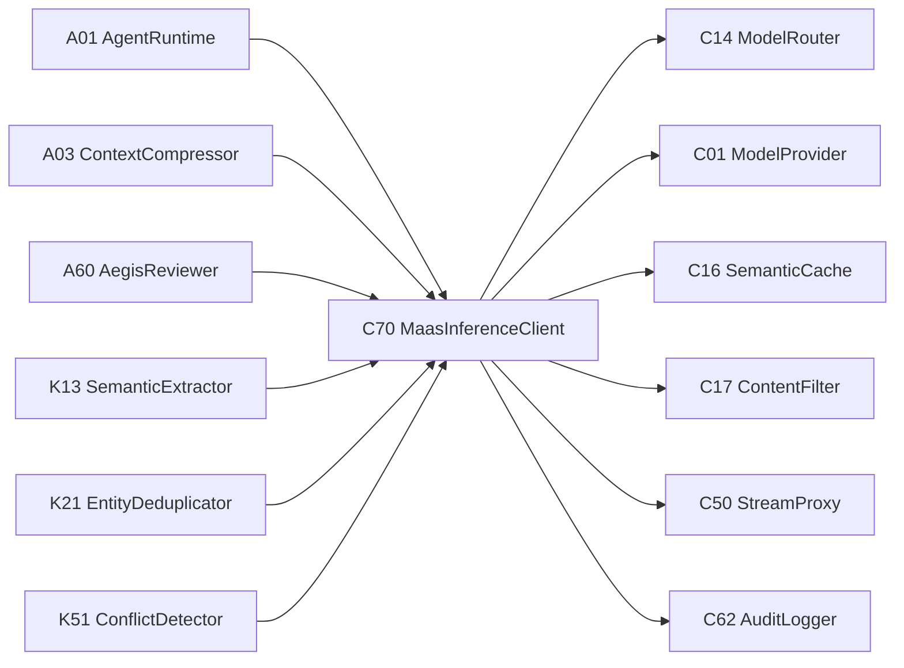

# 平台组件注册表与跨模块依赖

## 1. 文档目的

本文档统一 Legion 平台四类组件编号与跨模块依赖规则：

| 前缀 | 模块 | 主索引 | 职责 |
|------|------|--------|------|
| A | Agent Engine | [agent_components/index.md](./agent_components/index.md) | Agent 运行时、任务、工具、记忆、学习、质量与工作流 |
| C | MaaS | [maas_components/index.md](./maas_components/index.md) | 模型提供商、路由、计费、可靠性、流式、观测与推理端口 |
| K | Know / LLM Wiki | [know_components/index.md](./know_components/index.md) | 语料接入、图谱构建、索引检索、治理、MCP |
| X | Common | [common_components/index.md](./common_components/index.md) | 跨模块基础设施：事件、嵌入、审计、安全抓取、路径与输出净化 |

本表只维护跨模块边界，模块内部依赖仍以各自注册表为准。

## 2. 跨模块依赖规则

1. `A*`、`K*` 上层业务组件不得直接依赖 `C01 ModelProvider` 或具体 provider SDK。
2. 上层需要 LLM 推理时统一依赖 `C70 MaasInferenceClient`。
3. `C14 ModelRouter` 是 MaaS 内部路由组件，不作为 Agent/Know 的稳定调用 API。
4. `X*` 是平台基础设施，可被 A/C/K 任意模块依赖，但不得反向依赖 A/C/K。
5. MaaS 的 `C62 AuditLogger` 只记录推理请求审计；跨模块治理证据链统一使用 `X02 ImmutableAuditLog`。
6. 审批工单统一由 `A62 ApprovalService` 管理；知识状态机和裁决规则由 `K50 KnowledgeGovernance` 管理。

## 3. 跨模块依赖主表

| 使用方 | 依赖 | 类型 | 说明 |
|--------|------|------|------|
| A01 AgentRuntime | C70 MaasInferenceClient | 必须 | 主循环同步/流式 LLM 调用 |
| A03 ContextCompressor | C70 MaasInferenceClient | 可选 | 辅助摘要和循环检查点；缺失时仅保留零 LLM 压缩策略 |
| A60 AegisReviewer | C70 MaasInferenceClient | 必须 | 固定质量评审，不经过 AgentRuntime |
| A62 ApprovalService | X00 EventBus | 必须 | 审批工单状态广播 |
| A62 ApprovalService | A10 TaskScheduler | 必须 | HardLoop 审批后恢复任务 |
| K13 SemanticExtractor | C70 MaasInferenceClient | 可选 | LLM 知识抽取；缺失时只使用结构化抽取 |
| K13 SemanticExtractor | X05 OutputSanitizer | 必须 | LLM 输出标签与 JSON 清理 |
| K21 EntityDeduplicator | C70 MaasInferenceClient | 可选 | LLM tiebreak；缺失时仅用规则和相似度去重 |
| K32 VectorStore | X01 EmbeddingProvider | 必须 | 知识块向量化 |
| K40 HybridRetriever | K31 KnowledgeFtsEngine | 必须 | 最小可用全文检索 |
| K40 HybridRetriever | K32 VectorStore | 可选 | 语义检索源 |
| K40 HybridRetriever | K33 WikiLinkGraph | 可选 | 图遍历扩展源 |
| K50 KnowledgeGovernance | X02 ImmutableAuditLog | 必须 | 状态转换、裁决和证据链 |
| K50 KnowledgeGovernance | A62 ApprovalService | 可选 | 需要人类审批时创建统一审批工单 |
| K51 ConflictDetector | C70 MaasInferenceClient | 可选 | 轻量 LLM 冲突判断 |
| C16 SemanticCache | X01 EmbeddingProvider | 推荐 | 语义缓存向量编码；也可使用 MaaS 内部嵌入后端适配 |
| C62 AuditLogger | X02 ImmutableAuditLog | 可选适配 | 生产可把推理审计摘要镜像到不可变审计链 |

## 4. 推理端口边界

`C70` 是 A/K 模块可以依赖的唯一 MaaS 推理端口。这样路由、重试、缓存、内容过滤、审计等 MaaS 内部能力可以演进，而不破坏 Agent 与 Know 的组件契约。

## 5. 审批与知识治理边界

| 能力 | 权威组件 | 边界 |
|------|----------|------|
| 审批工单创建、分配、状态、通知、恢复链 | A62 ApprovalService | 统一管理人工审批工作台与 HardLoop/预算/质量/知识审批工单 |
| 知识状态机、冲突裁决、版本状态、可检索性 | K50 KnowledgeGovernance | 决定 chunk 从 PendingReview/Conflicting 到 Approved/Rejected/Archived 的状态转换 |
| 审批事件广播 | X00 EventBus | 只做事件分发，不包含审批业务判断 |
| 治理证据链 | X02 ImmutableAuditLog | 记录状态转换、裁决、审批引用，不负责 UI 工单 |

K50 可以调用 A62 创建 `KnowledgeReview` 工单，但 A62 不直接修改知识状态；人类审批结果回调 K50 后，由 K50 执行 CAS 状态转换并写入审计。

## 6. 装配检查

| Profile | 必备跨模块能力 |
|---------|----------------|
| Agent minimal | A00/A01/A02/A10/A11/A20 + C70 + X00 |
| Agent standard | minimal + A60/A61/A63 + X01/X02 |
| Know minimal | K10/K12/K20/K21/K22/K30/K31/K40/K41 + X02/X04/X05 |
| Know standard | minimal + K13/K32/K50/K51/K52/K60/K61 + C70 + X00/X01/X03 |
| MaaS minimal | C01/C03/C14/C30/C31/C32/C50/C62/C70 |
