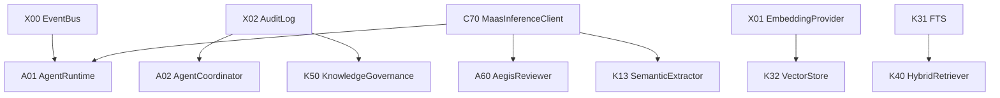

# 跨模块依赖计划

## 依赖规则

- A/K 上层不直接依赖 `C01 ModelProvider` 或 provider SDK。
- 需要 LLM 推理时统一通过 `C70 MaasInferenceClient`。
- X 组件只提供平台基础设施，不反向依赖 A/C/K。
- 审批工单由 `A62 ApprovalService` 管理，知识状态机由 `K50 KnowledgeGovernance` 管理。

## 优先级

| 优先级 | 组件 | 原因 |
|--------|------|------|
| P0 | X00 EventBus | 任务状态、流式 token、审批和治理事件都依赖它 |
| P0 | X02 ImmutableAuditLog | 三原则中的可观测和可治理证据链 |
| P0 | C70 MaasInferenceClient | Agent/Know/Aegis 的统一推理入口 |
| P1 | X01 EmbeddingProvider | Agent 记忆、Know 向量检索、MaaS 语义缓存共享 |
| P1 | X04 PathGuard / X05 OutputSanitizer | 文件扫描、工具执行、报告导出、MCP 输出的风险边界 |
| P2 | A62 ApprovalService | 工作流审批、异常升级、知识审核的统一工单 |

## 装配修正项

| 项 | 计划 |
|----|------|
| MaaS minimal | 必须包含 `C04 ModelMapper`，因为 `C14` 必须依赖 `C04` |
| MaaS lifecycle | 初始化顺序扩展到 `L8`，最后构造 `C70` |
| Know standard | 若定位生产知识库，应包含 `A62` 或明确是无人工审批 profile |
| Agent 依赖图 | 改为能力域编排图，避免视觉上继续表达严格层级依赖 |

## 阻塞关系

