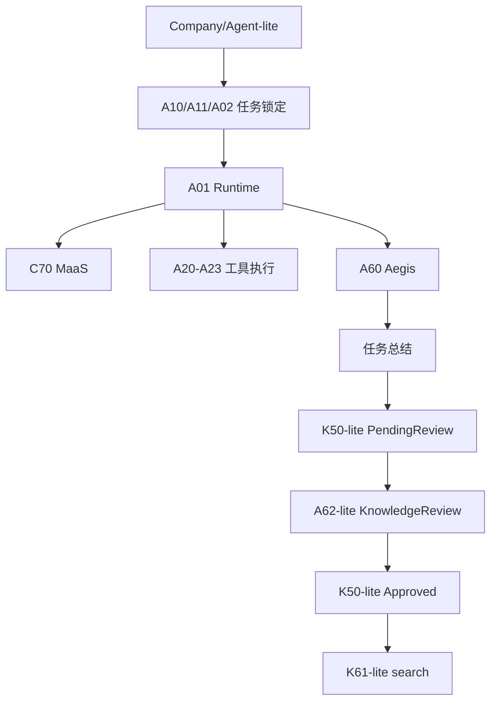

# MVP 关键路径优化计划

## 目标

避免“演示闭环需要的治理/组织能力排到后面”导致 MVP 断链。将完整能力拆成 lite/full 两级：lite 支撑闭环，full 支撑产品化。

## 必须前置的 lite 能力

| 能力 | 阶段 | 最小范围 | full 所在阶段 |
|------|------|----------|---------------|
| Company/Agent-lite | P2 | company_id、agent_id、role、budget、permission、status | P4 组织协作 |
| A62-lite | P2 | 工单创建、审批结论、resume_task、事件广播 | P4 A62-full |
| K50-lite | P3 | PendingReview/Approved/Rejected、CAS、X02 审计 | P4/P5 完整治理 |
| K61-lite | P3 | search_knowledge、get_node | P4/P5 完整 MCP |

## MVP 闭环

## 验收

- 没有完整组织 UI 时，仍可创建 company 和 agent 记录。
- 没有完整审批工作台时，仍可创建审批工单并记录人工结论。
- 没有完整知识治理时，AI 知识仍不能绕过 `PendingReview`。
- 没有完整 MCP 工具集时，Agent 仍可通过 `search_knowledge` 查询已批准知识。
