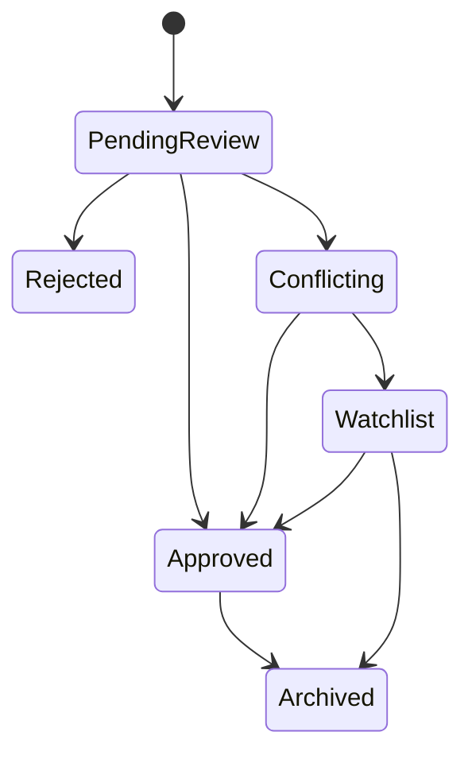

# Know 知识治理计划

## 目标

保证 AI 产出知识不会未经审核进入正式知识库，并让冲突、版本、来源、裁决可追溯。

## 组件职责

| 组件 | 职责 |
|------|------|
| K50 KnowledgeGovernance | 知识状态机、版本状态、CAS 转换、裁决规则 |
| K51 ConflictDetector | 语义相似冲突与显式引用冲突 |
| K52 QualityScorer | 新鲜度、来源可信度、引用度、冲突度 |
| A62 ApprovalService | 人工审批工单、通知、超时、审批人分配 |
| X02 ImmutableAuditLog | 状态转换和裁决证据链 |

## Lite / Full 拆分

| 能力 | 阶段 | 范围 |
|------|------|------|
| K50-lite | P3 | `PendingReview / Approved / Rejected`，CAS 状态转换，X02 审计 |
| A62-lite | P2/P3 | `KnowledgeReview` 工单创建、审批结论、事件广播 |
| K51-lite | P3 | 可选；缺失时所有 AI 知识仍进入 PendingReview |
| K50-full | P4+ | `Conflicting / Watchlist / Archived`、冲突裁决、版本回滚、质量策略 |

## 状态流程

## 验收

- AI 写入默认 `PendingReview`。
- `Conflicting -> Approved` 必须有裁决记录。
- A62 只管理审批工单，不直接改知识状态。
- K50 接收审批结论后执行知识状态转换。
- P3 MVP 至少支持 `PendingReview -> Approved/Rejected`。
