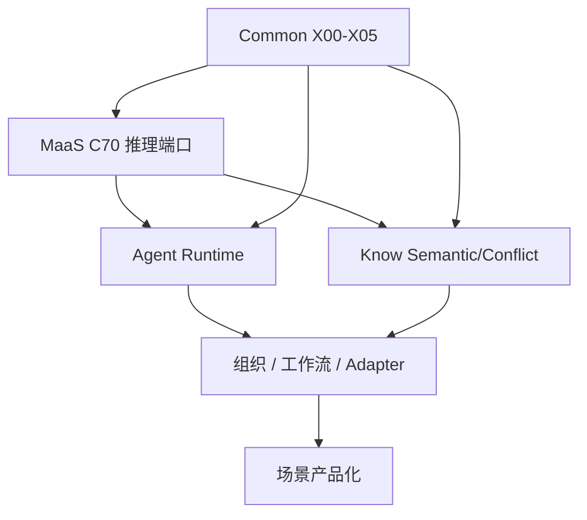

# Legion 项目计划索引

本目录依据 [Legion.md](../design/architecture/Legion.md) 的产品方案与 [platform-component-registry.md](../design/architecture/platform-component-registry.md) 的 A/C/K/X 组件边界，拆分 Legion 的项目实施计划。

## 当前执行焦点

当前工程执行优先级为 **Agent 优化优先**：

- 近期继续围绕 `legion/legionAgent` 完善运行时、TUI、上下文、配置、可观测和本地开发体验。
- MaaS 网关服务端暂不作为当前编码目标，仅保留组件规格、C70 端口契约和后续实施计划。
- Agent 侧已实现的 C70 HTTP 客户端可先直连 OpenAI-compatible provider 或后续接入内部 MaaS 网关；真正的 `legion-maas` 网关服务端在 Agent 稳定后单独启动。

## 计划总纲

| 模块 | 目录 | 目标 |
|------|------|------|
| 平台总计划 | [00-platform/index.md](./00-platform/index.md) | 定义全局阶段、跨模块依赖、里程碑和验收口径 |
| Common 公共组件 | [01-common/index.md](./01-common/index.md) | 先交付事件、嵌入、审计、安全抓取、路径守卫、输出净化 |
| MaaS 模型调度层 | [02-maas/index.md](./02-maas/index.md) | 后续阶段处理网关服务端；当前仅维护多模型纳管、路由、计费、可靠性、流式与 C70 推理端口计划 |
| Agent 引擎 | [03-agent/index.md](./03-agent/index.md) | Agent 运行时、任务调度、工具、记忆、学习、质量与工作流 |
| Know / LLM Wiki | [04-know/index.md](./04-know/index.md) | 知识接入、图谱构建、混合检索、治理与 MCP |
| 组织 / 工作流 / Adapter | [05-organization-workflow-adapter/index.md](./05-organization-workflow-adapter/index.md) | 产品基础能力与控制平面：组织、角色、通讯、流程、执行载体 |
| 应用场景 | [06-product-scenarios/index.md](./06-product-scenarios/index.md) | 面向软件开发、内容生产、客服、数据分析、游戏研发的落地计划 |

## 全局阶段

| 阶段 | 名称 | 核心目标 | 主交付 |
|------|------|----------|--------|
| P0 | 架构基线 | 固化 A/C/K/X 边界、Profile、依赖和治理原则 | 组件注册表、跨模块契约、开发规范 |
| P1 | 平台底座 | 近期先稳住 Agent 侧 C70 客户端和 Common 契约；MaaS minimal 网关服务端后续单独启动 | X00-X05、Agent-side C70 client、MaaS server backlog |
| P2 | Agent 可运行 | 单 Agent 可接任务、调用模型、执行工具、写审计、基础质量评审，并具备最小身份/组织上下文 | A00/A01/A02/A10/A11/A20/A60、Company/Agent-lite、A62-lite |
| P3 | Know 可治理可检索 | 知识从代码/文档进入图谱，支持检索，并跑通最小知识审核链 | K10/K12/K20/K30/K31/K32/K33/K40、K50-lite、K61-lite、KnowledgeReview |
| P4 | 组织协作 | 多 Agent 组织、通讯、完整审批、工作流 DSL 和 Adapter 控制平面 | 组织模型-full、A62-full、A70、Adapter 协议 |
| P5 | 学习进化 | 经验记忆、GEP、能力资产、退化检测和成长报告 | A40-A64 完整链路 |
| P6 | 场景产品化 | 先交付一个标杆场景完整闭环，其他场景提供骨架模板 | 标杆场景 full template、其他场景 skeletal template |

## 全局依赖顺序

## 验收原则

- 可观测：每个阶段必须有调用链、任务链、知识链或审批链的可追踪证据。
- 可治理：高风险行为必须能通过审批、权限、配额或人工裁决介入。
- 可控风险：预算、权限、路径、外部抓取、知识传播和 Agent 自主行为必须有默认边界。
