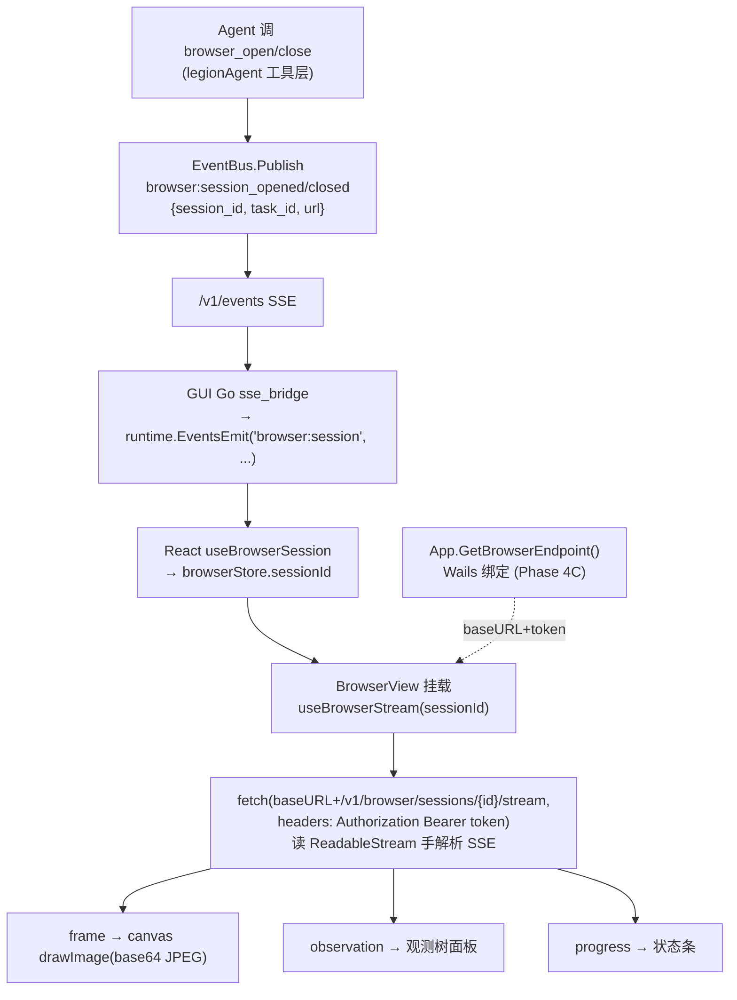

# GUI 内置浏览器视图 UI 技术 spec

> 让 Wails GUI 的用户实时看见 Agent 的浏览过程：canvas 渲染 screencast 帧 + 观测树面板 + 进度状态。消费 Phase 2 的 SSE 流 `/v1/browser/sessions/{id}/stream`（observation/frame/progress），用 Phase 4C 的 `GetBrowserEndpoint()` 拿 `{baseURL, token}`。**只读展示**（spec §3.2），接管模式留 Phase 7。

<!-- @section: overview -->
## 概述

Agent 内置浏览器 Phase 1-4 已把后端与 GUI 的 loopback 接入落地（PR #68/#69/#70/#72/#73/gui#14 全合 master）。本 spec 补最后一块用户可见的部分：**GUI 里的浏览器视图 UI**——前端渲染 Agent 正在浏览的页面。

技术选型（brainstorm 定案）：
- **session 发现**：后端在 `browser_open`/`browser_close` 成功后向 `observability.EventBus`（背 `/v1/events`）发 `browser:session_opened`/`browser:session_closed` 事件；GUI Go 侧 `sse_bridge` 转发为 Wails event；React 据此知道活跃 `session_id`。事件驱动，复用现有桥，无轮询。
- **stream 鉴权**：React 用 `fetch()` + `ReadableStream` 手解析 SSE（带 `Authorization: Bearer`，token 不进 URL——遵"敏感数据不进 URL"），而非原生 `EventSource`（不能设 header）。
- **渲染**：帧（base64 JPEG）经 `Image` → `ctx.drawImage` 画到 `<canvas>`，为后续 set-of-marks 视觉叠加留口。

跨两仓：**legionAgent**（后端发事件）+ **legionAgentGUI**（Go 桥 + React UI）。

<!-- @end-section -->

<!-- @section: architecture -->
## 1. 架构与数据流



**两条 SSE 职责分离**（沿用 Phase 2 决策）：
- `/v1/events`（现有）：承载 session 生命周期 + 审批 + 运行事件（低频控制面）。**新增** `browser:session_*` 走它。
- `/v1/browser/sessions/{id}/stream`（Phase 2）：承载 observation/frame/progress（高频，含视频帧）。React 直连它。

<!-- @end-section -->

<!-- @section: details -->
## 2. 组件详细设计（各一职责）

### 2.1 后端 legionAgent — 发 session 生命周期事件

**落点**：`internal/tool/browser.go` 的 `browser_open`/`browser_close` handler 成功分支。需要一个事件发射端口注入 `BrowserToolOptions`（避免 tool 层直依赖 observability）。

```go
// BrowserToolOptions 增字段（Phase 4-view）
type BrowserToolOptions struct {
    Enabled bool
    Runtime browser.RuntimeAPI
    Events  BrowserEventSink // 可选；nil 则不发事件（不破坏现有测试）
}

// BrowserEventSink 是 tool 层对"发浏览器会话生命周期事件"的最小依赖。
type BrowserEventSink interface {
    SessionOpened(ctx context.Context, sessionID, taskID, url string)
    SessionClosed(ctx context.Context, sessionID string)
}
```
- `browser_open` 成功（拿到 `out.SessionID`）后：`opts.Events.SessionOpened(ctx, out.SessionID, taskID, url)`（taskID 从 ctx / call 取，url = 请求的 url）。
- `browser_close` 成功后：`opts.Events.SessionClosed(ctx, sessionID)`。
- **接线**（cli/command.go）：`Events` 用一个把 `observability.EventBus.Publish(EventEnvelope{Type:"browser:session_opened"/"closed", Data:{...}})` 包起来的适配器（在 cli 层桥接，tool 不依赖 observability，方向正确——同 Phase 3 store 适配器模式）。事件 `Data` 形如 `{"session_id":"sess-1","task_id":"t1","url":"https://..."}`。

> **fail-loud**：发事件失败按现有 platform sink 惯例 Warn 记录不致命（事件是观测辅助，丢一条不该崩任务；但不静默）。

### 2.2 GUI Go — sse_bridge 转发 browser:session

**落点**：`sse_bridge.go` 的 `consumeSSEWithToken` 事件分发处（已有 `case "runtime.token","token"` 等分支）。加：
```go
case "browser:session_opened", "browser:session_closed":
    emit("browser:session", map[string]any{"type": eventType, "data": rawData})
```
（`data` 是原始 SSE data 字符串，React 侧 `JSON.parse`——沿用现有 `agent:approval` 的 `{type,data}` 范式，见 `useAgentEvents`。）

### 2.3 GUI React — store / hooks / 组件

**`stores/browserStore.ts`**（zustand，一职责=浏览器视图状态）
```ts
interface BrowserState {
  sessionId: string | null
  frameDataUri: string | null   // 最新帧 data:image/jpeg;base64,...
  elements: BrowserElement[]     // 观测树可交互元素 [{ref,role,name,value}]
  observationText: string
  progress: { action: string; status: string; ref?: string } | null
  connected: boolean
  lastEventId: number
  setSession(id: string | null): void
  onFrame(mime: string, b64: string): void
  onObservation(obs: { elements: BrowserElement[]; text: string }): void
  onProgress(p: {...}): void
  setConnected(c: boolean): void
}
```

**`hooks/useBrowserSession.ts`**：`EventsOn('browser:session', h)`；`session_opened` → `setSession(id)`，`session_closed`（若匹配当前）→ `setSession(null)`。挂在 App 顶层（与 `useAgentEvents` 并列）。

**`lib/sseReader.ts`**（通用，无 React 依赖，易测）：
```ts
// readSSE 用 fetch+ReadableStream 消费一条 SSE 流，带 Authorization。
// 逐事件回调 {event, id, data}；返回 abort 函数。手解析 SSE 帧（event:/id:/data:/空行分隔）。
async function readSSE(url: string, token: string, lastEventId: number,
  onEvent: (e: {event: string; id?: string; data: string}) => void,
  signal: AbortSignal): Promise<void>
```
- 请求头 `Authorization: Bearer ${token}`（token 非空时）+ `Last-Event-ID: ${lastEventId}`（>0 时）。
- 读 `res.body.getReader()`，`TextDecoder` 累积，按 `\n\n` 切事件，解析 `event:`/`id:`/`data:` 行。

**`hooks/useBrowserStream.ts`**：`sessionId` 变化时，`GetBrowserEndpoint()` 拿 `{baseURL, token}`，`readSSE(baseURL+'/v1/browser/sessions/'+id+'/stream', token, lastEventId, dispatch, signal)`；事件按 `event` 路由到 store（frame/observation/progress）；断线（reader 结束且 sessionId 仍在）带 `lastEventId` 重连（帧可丢、状态补发——后端 Phase 2 环形缓冲负责补）；组件卸载/session 清空时 abort。

**`components/BrowserView.tsx`**：
- `<canvas ref>`：`frameDataUri` 变 → `new Image()`，`onload` → `ctx.drawImage(img, 0, 0, canvas.width, canvas.height)`。canvas 尺寸随容器；保持宽高比。
- 观测树面板：`elements` 列表渲染 `[e1] <button> 搜索`（可折叠）。
- 进度状态条 + 连接徽章（复用 `ConnectionBadge` 风格）。
- `sessionId` 为 null → 空态提示"Agent 未在浏览"。
- **只读**：canvas 无点击回传；标 `pointer-events` 仅用于将来接管开关（Phase 7，本期禁用）。

**挂载点**：GUI 加"浏览器"视图，与现有 ChatPanel/StatusPanel 并列（侧栏/标签切换）——跟随现有 `App.tsx` 的面板组织方式，加一个可切换的 BrowserView 面板。

<!-- @end-section -->

<!-- @section: error-handling -->
## 3. 错误处理

- **stream 连接失败/断线**：`useBrowserStream` 记 `connected=false` + `console.error`（非静默，遵 GUI fail-loud 惯例见 `sse_bridge` 注释），带 `Last-Event-ID` 重连；连续失败退避（如 2s）。UI 显"重连中"。
- **token 为空**（未加固/serve 未起）：不发 Authorization 头；若 401/403 则显式提示"未鉴权"而非空白。
- **帧解码失败**：`Image.onerror` → 保留上一帧 + `console.warn`，不崩。
- **观测/进度 JSON 解析失败**：`console.error` 记录该条，跳过，不崩（单条坏事件不毁视图）。
- **后端事件发射失败**：Warn 记录（§2.1），不影响 Agent 任务。

<!-- @end-section -->

<!-- @section: testing -->
## 4. 测试

**后端 legionAgent**
- `browser_open`/`browser_close` 成功后调用 `Events.SessionOpened/Closed`（用假 sink 断言，无 Chromium）。
- cli 适配器把 sink 调用桥到 `EventBus.Publish` 正确的 Type/Data（单测）。
- `Events` 为 nil 时不 panic（不破坏现有）。

**GUI React（vitest + @testing-library）**
- `sseReader`：喂一段 SSE 文本（含 event/id/data + 分帧空行、跨 chunk 边界），断言逐事件解析正确 + Authorization 头设置。
- `browserStore`：onFrame/onObservation/onProgress reducer 更新正确；session 清空重置。
- `useBrowserSession`：模拟 `EventsOn('browser:session')` 派发 opened/closed → sessionId 变更。
- `BrowserView`：喂假 frame(dataURI)/observation → 断言 canvas `drawImage` 被调（mock 2d context）+ 观测树渲染 `[e1]` 文本；空 session 显空态。

<!-- @end-section -->

<!-- @section: scope -->
## 5. 范围边界（不做）

| 项 | 本 spec | 后续 |
|---|---|---|
| 接管模式（回注鼠标/键盘） | 只读展示 | Phase 7：canvas 事件回注 Page |
| set-of-marks 视觉标注框 | canvas 留口 | 视觉模型分叉：观测切 screenshot+标注 |
| 多 tab 视图 | 只显活跃 tab | tab 管理 |
| wailsjs TS 绑定 | plan 含 `wails generate module` 重生 GetBrowserEndpoint 绑定 | — |
| 帧限流/开关 | 后端 Phase 2 已做（~8fps、仅订阅时开） | — |

<!-- @end-section -->

## 相关文档

- [[design-agent-browser-runtime-001|Browser Runtime 技术 spec]] — Phase 1-4 后端（本 UI 消费其 §4.3 SSE 流与 §3.4 握手）
- [[agent-browser-design]] — 架构设计文档 v2.4（§3.2 只读展示、§4.3 SSE 事件模型）
- [[spec-agent-browser-001|Agent 内置浏览器 PRD]] — FR-4 流式观测视图的产品需求
- [[legion-gui-wails-gotchas]] — GUI Wails 启动/绑定/事件踩坑
